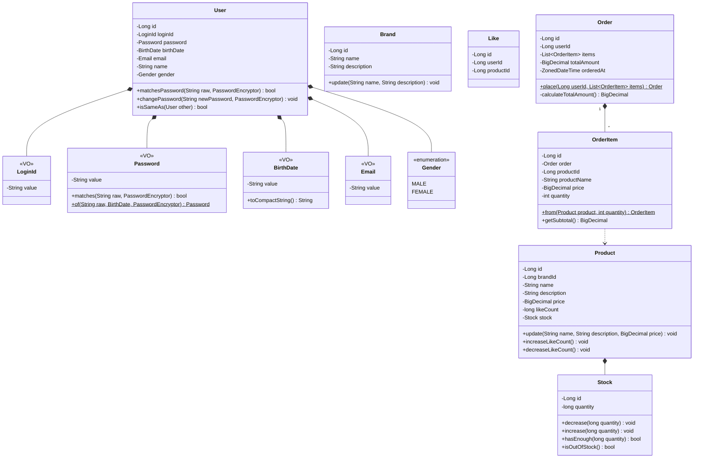

# Class Diagram

```mermaid
classDiagram
    %% ─── User Domain ───────────────────────────────────────
    class User {
        -Long id
        -LoginId loginId
        -Password password
        -BirthDate birthDate
        -Email email
        -String name
        -Gender gender
        +matchesPassword(String raw, PasswordEncryptor) bool
        +changePassword(String newPassword, PasswordEncryptor) void
        +isSameAs(User other) bool
    }
    class LoginId {
        <<VO>>
        -String value
    }
    class Password {
        <<VO>>
        -String value
        +matches(String raw, PasswordEncryptor) bool
        +of(String raw, BirthDate, PasswordEncryptor)$ Password
    }
    class BirthDate {
        <<VO>>
        -String value
        +toCompactString() String
    }
    class Email {
        <<VO>>
        -String value
    }
    class Gender {
        <<enumeration>>
        MALE
        FEMALE
    }

    %% ─── Product Domain ────────────────────────────────────
    class Brand {
        -Long id
        -String name
        -String description
        +update(String name, String description) void
    }
    class Product {
        -Long id
        -Long brandId
        -String name
        -String description
        -BigDecimal price
        -long likeCount
        -Stock stock
        +update(String name, String description, BigDecimal price) void
        +increaseLikeCount() void
        +decreaseLikeCount() void
    }
    class Stock {
        -Long id
        -long quantity
        +decrease(long quantity) void
        +increase(long quantity) void
        +hasEnough(long quantity) bool
        +isOutOfStock() bool
    }

    %% ─── Like Domain ────────────────────────────────────────
    class Like {
        -Long id
        -Long userId
        -Long productId
    }

    %% ─── Order Domain ───────────────────────────────────────
    class Order {
        -Long id
        -Long userId
        -List~OrderItem~ items
        -BigDecimal totalAmount
        -ZonedDateTime orderedAt
        +place(Long userId, List~OrderItem~ items)$ Order
        -calculateTotalAmount() BigDecimal
    }
    class OrderItem {
        -Long id
        -Order order
        -Long productId
        -String productName
        -BigDecimal price
        -int quantity
        +from(Product product, int quantity)$ OrderItem
        +getSubtotal() BigDecimal
    }

    %% ─── Relationships ──────────────────────────────────────
    User *-- LoginId
    User *-- Password
    User *-- BirthDate
    User *-- Email
    User *-- Gender

    Product *-- Stock

    Order "1" *-- "*" OrderItem
    OrderItem ..> Product
```

