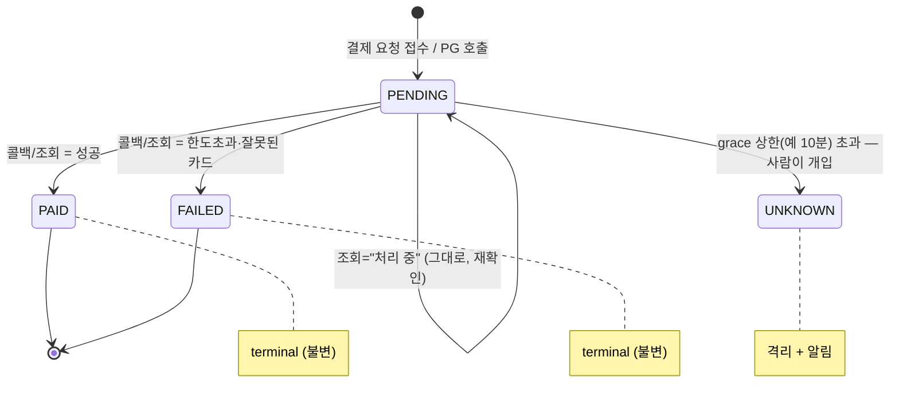
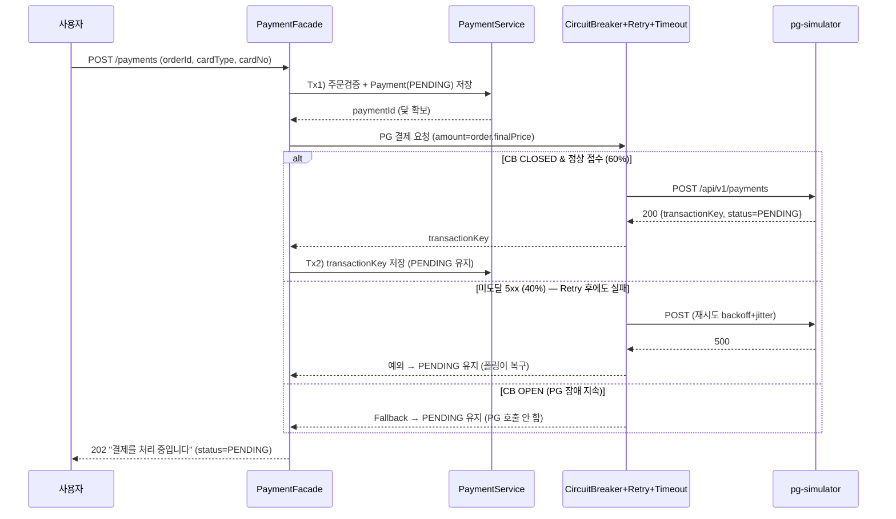
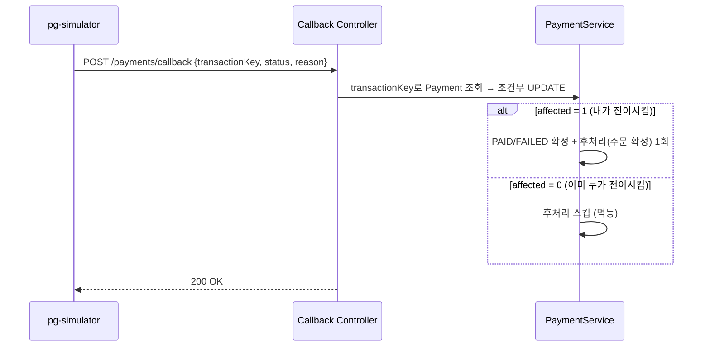
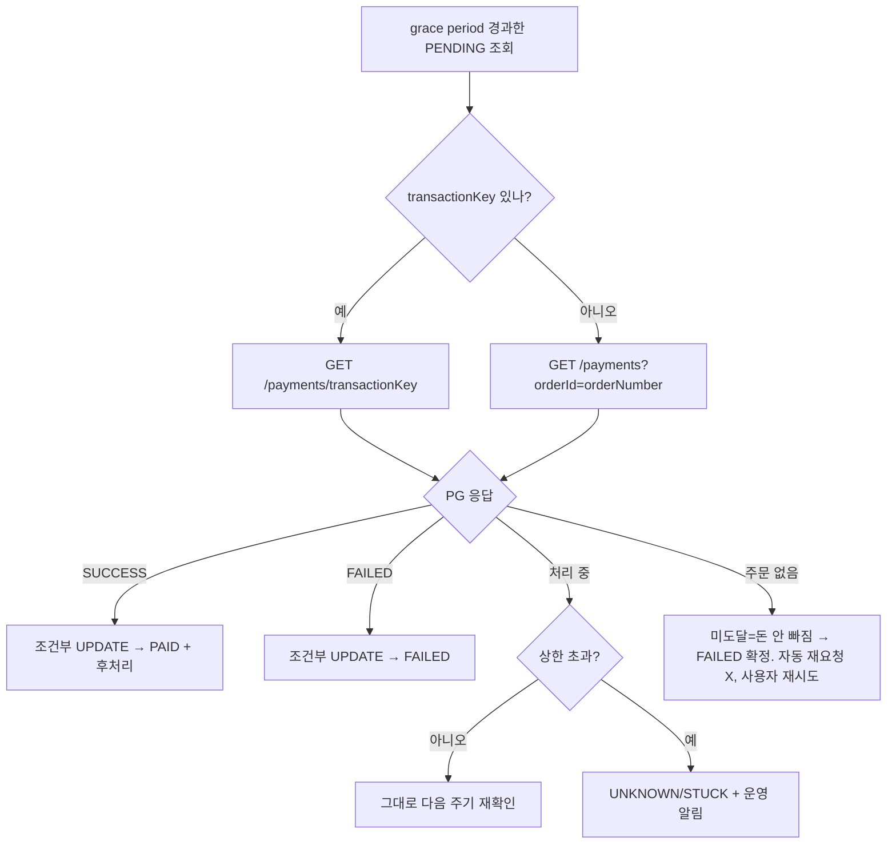
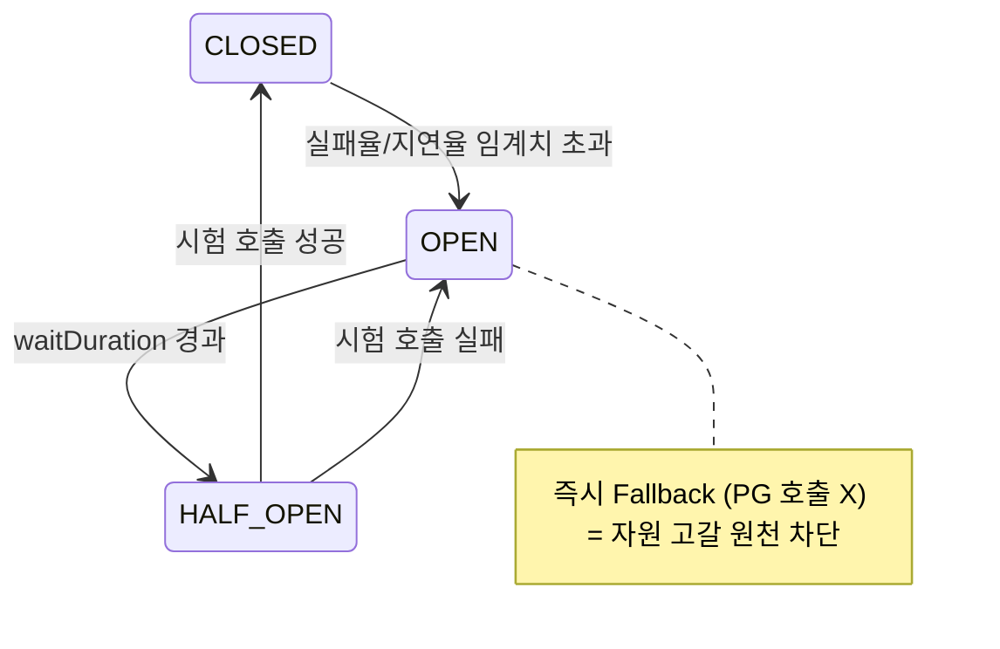

# 결제 도메인 설계 (Payment Domain Design)

> [!abstract] 설계 원칙
> 외부 PG 시스템은 **반드시 느려지고·실패하고·중복되고·응답을 잃는다.**
> 따라서 "성공 경로"를 짜는 것이 아니라, **모든 어긋남에서 결국 정합성으로 수렴하는 상태 기계**를 짠다.
> 모든 장치는 결국 `PENDING`(= "우리는 아직 모른다"를 정직하게 표현하는 상태)을 중심으로 연결된다.

---

## 1. 범위와 목표

### 1.1 기능 요구사항

- 주문(`orderId`)과 결제 수단(`cardType`, `cardNo`)을 입력받아 외부 PG(`pg-simulator`)와 연동해 결제를 처리하는 API를 `commerce-api`에 추가한다.
- PG는 **비동기 결제**다 — 요청 접수와 실제 처리(승인/거절)가 분리되어 있다.

### 1.2 PG(`pg-simulator`) 동작 특성 — 설계가 방어해야 할 현실

| 항목 | 값 | 설계 함의 |
|---|---|---|
| 요청 성공 확률 | 60% | 40%는 `HTTP 500`으로 **요청 자체가 미도달** → transient, 재시도 안전 |
| 요청 지연 | 100ms ~ 500ms | 동기 응답(접수/실패)까지의 시간 |
| 처리 지연 | 1s ~ 5s | 접수 후 실제 승인/거절까지 — **이 결과는 콜백/폴링으로만 받는다** |
| 처리 결과 - 성공 | 70% | 콜백 `status=SUCCESS` |
| 처리 결과 - 한도 초과 | 20% | 콜백 `status=FAILED`, `reason="한도초과"` (예외 아님) |
| 처리 결과 - 잘못된 카드 | 10% | 콜백 `status=FAILED`, `reason="잘못된 카드"` (예외 아님) |

> [!important] 실패가 들어오는 "채널"을 구분하는 것이 설계의 출발점
> - **동기 POST 응답 채널**: ① 접수 성공(`PENDING` + `transactionKey`) / ② 미도달(`HTTP 500`, 40%) / ③ 입력 검증 실패(`HTTP 4xx`, 우리 측 버그) — **한도초과·잘못된 카드는 이 채널로 오지 않는다.**
> - **비동기 콜백 채널**: 성공 / 한도초과 / 잘못된 카드가 `status` + `reason` **정상 페이로드**로 온다(예외가 아니다).
>
> → 그래서 Retry/CircuitBreaker가 잡아야 할 "실패"는 **동기 채널의 5xx·타임아웃**뿐이고, 처리 결과의 실패(한도초과/잘못된 카드)는 **재시도 대상이 아니라 콜백으로 받아 확정**할 대상이다.

### 1.3 Resilience 목표 (Round 6 Quest)

- **Must-Have**: Fallback, Timeout, CircuitBreaker
- **Nice-To-Have**: Retryer
- 외부 시스템 장애 시에도 **내부 시스템은 정상 응답**(장애 전파 차단), 콜백이 오지 않아도 **폴링/수동 API로 상태 복구**.

---

## 2. 식별자 모델 — "닻"을 못박기

세 가지 식별자가 등장한다. 추적이 **하나에만 의존하면** 타임아웃 상황에서 끊긴다.

| 식별자 | 주체 | 타입 | 역할 |
|---|---|---|---|
| `orderNumber` | 우리 | `String` (예: `"1351039135"`) | **reconciliation 의 닻**. 우리가 절대 잃어버리지 않는 식별자. PG 호출 시 PG의 `orderId`로 전달 |
| `OrderModel.id` / `PaymentModel.id` | 우리 | `Long` (PK) | 내부 도메인 연관관계 |
| `transactionKey` | PG | `String` (예: `"20260626:TR:a1b2c3"`) | PG가 응답으로 발급하는 정밀한 핸들. **타임아웃 시 못 받을 수 있음(nullable)** |

> [!note] 모델 B(서버가 거래 ID 발급)의 빈틈과 해결
> 이 PG는 `transactionKey`를 응답으로 발급한다(모델 B). 그런데 **타임아웃 시 그 응답 자체를 못 받는다**(닭-달걀). 그래서 추적은
> **`orderNumber`(우리가 잃지 않는 닻) + `transactionKey`(PG의 정밀 핸들)** 둘 다 보유하고,
> `transactionKey`가 없으면 `GET /payments?orderId={orderNumber}`로 되짚는다.

### 2.1 요청 본문과 금액(amount) 결정

```http
POST /api/v1/payments
X-Loopers-LoginId: {loginId}
X-Loopers-LoginPw: {loginPw}

{ "orderId": "1351039135", "cardType": "SAMSUNG", "cardNo": "1234-5678-9814-1451" }
```

- 요청 `orderId`는 우리 주문의 **`orderNumber`** 로 매핑한다(주문을 조회해 소유자·상태 검증).
- **`amount`는 클라이언트가 보내지 않는다.** 서버가 `order.finalPrice`에서 도출해 PG로 전달한다(금액 위변조 방지).

---

## 3. 도메인 모델

### 3.1 `PaymentModel` (`@Entity`, `BaseEntity` 상속)

| 필드 | 타입 | 설명 |
|---|---|---|
| `orderId` | `Long` | 내부 `OrderModel.id` (FK) |
| `orderNumber` | `String` | PG-facing 닻(denormalize) — 폴링 시 join 없이 조회하기 위함 |
| `userId` | `Long` | 결제 사용자 |
| `cardType` | `CardType` enum | `SAMSUNG`, `KB`, `HYUNDAI` |
| `cardNo` | `String` | **마스킹 저장**(`1234-****-****-1451`) |
| `amount` | `Long` | `order.finalPrice`에서 도출 |
| `status` | `PaymentStatus` enum | 상태 머신의 현재 상태 |
| `transactionKey` | `String` (nullable) | PG 발급 거래 ID. 접수 응답을 받으면 채워짐 |
| `failureReason` | `String` (nullable) | FAILED 시 사유(한도초과/잘못된 카드) |

> `BaseEntity`가 `id`, `createdAt`, `updatedAt`, `deletedAt`을 자동 관리. `createdAt`은 **폴링 grace period 계산의 기준**이 된다.
> 도메인 모델은 자기 검증을 한다(생성자/전이 메서드에서 잘못된 인자는 `CoreException(BAD_REQUEST)`).

### 3.2 `PaymentStatus` — 상태 머신



| 상태 | 의미 | 외부(PG)와의 관계 |
|---|---|---|
| `PENDING` | 요청은 보냈으나 **결과 모름** | 불확실 |
| `PAID` | 성공 확정 (**terminal**) | 일치 ✅ |
| `FAILED` | 실패 확정(한도/카드/미도달) (**terminal**) | 일치 ✅ |
| `UNKNOWN` | 너무 오래 PENDING — **운영자 확인 필요** | 격리 🚨 |

**상태 머신이 강제하는 3가지 안전 규칙**

1. **종료 상태 불변(terminal)**: `PAID`/`FAILED`는 확정 → 중복 콜백/조회가 와도 안 바뀜 = **상태 레벨의 멱등성**.
2. **허용된 전이만**: `PENDING→PAID` O, `PAID→PENDING` X. 잘못된 전이는 `CoreException`.
3. **"모름"을 상태로 인정**: `PENDING`/`UNKNOWN`으로 억지 단정을 막는다 = 상태 불일치 방지의 근본.

---

## 4. 트랜잭션 경계 — 설계의 척추

> [!danger] 절대 하면 안 되는 것: "PENDING 저장 + PG 호출 + 결과 반영"을 하나의 트랜잭션으로 묶기
> PG HTTP 호출(최대 수 초) 동안 **DB 커넥션을 잡고 있으면**, 장애 전파(cascading failure)가 그대로 재현된다. PG가 느려지면 HikariCP 커넥션이 전부 점유되어 **결제와 무관한 요청까지 죽는다.**

### 4.1 트랜잭션을 3조각으로 쪼갠다

```
Tx1 (@Transactional)  : 주문 검증 후 Payment(PENDING) 저장 → 커밋  ← 닻 확보
   ── 트랜잭션 밖 ──    : PG 호출 (CircuitBreaker + Timeout + Retry 가 감싸는 지점). 커넥션 점유 X
Tx2 (@Transactional)  : 동기 응답 반영 (transactionKey 저장, 여전히 PENDING)
```

콜백/폴링도 각자 독립 트랜잭션(Tx3)에서 `PENDING→PAID/FAILED` 전이 + 후처리를 수행한다.

> [!note] CLAUDE.md 규약으로부터의 의도적 일탈
> 프로젝트 규약은 "여러 도메인에 걸친 원자성은 Facade에 `@Transactional`"이다. 하지만 **결제는 외부 HTTP 호출을 트랜잭션 밖으로 빼야 하므로 `PaymentFacade` 메서드 전체를 트랜잭션으로 감싸지 않는다.**
> → `PaymentFacade`는 **비트랜잭션** 메서드로, 트랜잭션 경계를 가진 `PaymentService`의 메서드들(Tx1, Tx2)을 순차 호출하고 그 사이에 PG 호출을 끼운다. 이 일탈의 이유는 "외부 호출 중 커넥션 점유 금지"다.

### 4.2 정합성 시나리오 점검

| 시점 | 사건 | 내부 상태 | 복구 |
|---|---|---|---|
| Tx1 후 | PG 호출 직전 서버 다운 | `PENDING`, `transactionKey=null` | 폴링이 `orderNumber`로 PG 조회 → "주문 없음"이면 미도달 확정 |
| PG 호출 중 | 타임아웃(응답 유실) | `PENDING` | 폴링이 PG 조회 → 결과대로 확정 |
| Tx2 직전 | 응답은 왔으나 저장 전 다운 | `PENDING`, `transactionKey=null` | 폴링이 `orderNumber`로 조회 → 결과 확정 |
| 콜백/폴링 | 동시 전이 시도 | 조건부 UPDATE로 1건만 승리 | 후처리 정확히 1회 (§6) |

---

## 5. 결제 요청 흐름 (Resilience 적용)



> [!important] 핵심: 어떤 분기든 사용자에게 "실패"라고 단정하지 않는다
> 동기 응답으로는 결과를 확정할 수 없다(처리는 1~5초 뒤 비동기). 따라서 **항상 `PENDING` + "처리 중" 안내**로 응답하고, 확정은 콜백/폴링에 맡긴다. 이것이 Fallback의 철학과 동일하다(§7.3).

> [!note] 사용자에게 최종 결과를 알리는 방식 — 클라이언트 폴링
> `202 PENDING` 이후 최종 결과(`PAID`/`FAILED`)는 **클라이언트가 결제 조회 API(`GET /api/v1/payments/{id}`)를 폴링**해서 확인한다. 서버 푸시(WebSocket/SSE/알림)는 두지 않는다 — 과제 범위 밖이고, 결과 확정의 단일 출처는 §6의 콜백/폴링이 채운 DB 상태다. 조회 API는 그 상태를 그대로 노출할 뿐이다.

---

## 6. 정합성 복구 — 콜백 + 폴링 + 수동 (3중 안전망)

### 6.1 역할 분담

```
콜백 (Push)  = 1차 방어선(빠른 정상 경로)   → 대부분 즉시 PAID/FAILED 확정
폴링 (Pull)  = 안전망(reconciliation)      → 콜백 놓친 PENDING을 주기적으로 쓸어담아 정합성 복구
수동 API     = 최후의 보루                  → UNKNOWN/STUCK 건을 운영자가 강제 재조회·확정
```

### 6.2 콜백 — `POST /api/v1/payments/callback`

PG가 처리 완료 시 트랜잭션 정보 전체를 통보한다: `{ transactionKey, orderId, cardType, cardNo, amount, status, reason }`. 여기서 `status`는 PG의 `TransactionStatus`(**`PENDING`/`SUCCESS`/`FAILED`**)이며, 우리 `PaymentStatus`로 매핑한다(`SUCCESS→PAID`, `FAILED→FAILED`, `PENDING`은 아직 미확정이므로 전이하지 않음). 우리가 전이 판단에 쓰는 것은 `transactionKey`(또는 `orderId`)·`status`·`reason`이고, `amount`·`cardNo`는 **전이를 허용할지 가르는 무결성 가드**(아래 [!danger])다.



> [!warning] 콜백 엔드포인트는 공개 엔드포인트
> PG가 호출하므로 `X-Loopers-LoginId/Pw`가 없다 → **인증 인터셉터에서 예외 처리(공개 경로 등록)** 필요. **진위 검증은 생략한다** — 이 과제는 견고한 인증/인가를 다루지 않고 `loginId`/`loginPw` 헤더 수준의 로그인만 처리하므로, 콜백에도 동일 수위를 맞춘다. (실무라면 서명/IP 화이트리스트를 둔다 — 설계 노트로만 명시.)

> [!danger] 콜백·폴링이 가져온 `amount`·`cardNo`가 우리가 저장한 값과 다르면 — 전이하지 않고 격리
> `amount` 불일치는 **금액 위변조**, `cardNo` 불일치는 **오배달(다른 거래의 콜백)** 가능성이다. 이때는 `status`가 `SUCCESS`여도 **`PAID`/`FAILED`로 전이하지 않고 `UNKNOWN`으로 격리 + 운영 알림**한다. "검증/로깅용"이라던 `amount`·`cardNo`는 사실 **전이를 허용할지 가르는 가드**다. 진위 검증을 생략한 만큼(위), 우리가 이미 보유한 값과의 대조가 유일한 무결성 방어선이 된다.

### 6.3 폴링(reconciliation) 스케줄러

콜백은 **안 올 수 있다**(재배포 중 유실/네트워크 유실/PG 발송 버그). 안 오면 주문이 영원히 `PENDING`에 갇힌다 → 폴링이 쓸어담는다.



**폴링 설계 디테일**

- **grace period**: 방금 PENDING 된 건을 즉시 조회하면 콜백에 일할 기회를 안 준다. 처리 지연 1~5초에서 역산해 **`createdAt`이 10초 이상 지난 PENDING**부터 폴링한다.
- **상한선**: `createdAt`이 **10분** 초과한 PENDING은 → `UNKNOWN`으로 격리 + 알림(영원한 PENDING 방지).
- **"조회"의 진짜 목적**: 무작정 재시도(이중결제 위험) vs 무작정 포기(돈 빠졌는데 주문 누락) 사이에서 **재시도해도 되는지 판단 근거**를 준다.

| PG 응답 | 의미 | 행동 |
|---|---|---|
| 처리 중(PENDING) | 도달함, 결과 미정 | 건드리지 마(재시도 ❌), 다음 주기 재확인 |
| 주문 없음 | 미도달, 돈 안 빠짐 | **FAILED로 확정** (자동 재요청 ❌). 재시도해도 이중결제는 없지만, 시스템이 임의 재호출하지 않고 사용자 재시도에 맡긴다 |
| SUCCESS/FAILED | 결과 확정 | 그 결과로 확정 |

### 6.4 수동 복구 API

`UNKNOWN`/오래된 `PENDING`을 운영자가 강제로 재조회·확정하는 관리 API(예: `POST /api/v1/payments/{id}/reconcile`). Quest 체크리스트 "수동 API 호출로 상태 복구"를 충족한다.

---

## 7. Resilience 3종 — Timeout / CircuitBreaker / Fallback (+ Retry)

### 7.1 Timeout — "언제 포기하고 자원을 회수할 것인가"

요청이 거치는 **모든 풀·외부 경계마다** 타임아웃이 있어야 한다(한 군데라도 비면 거기서 샌다).

| 레이어 | 설정 | 값(설계 기준) |
|---|---|---|
| HTTP - Connect | TCP 연결 수립 | `1s` |
| HTTP - Read(Socket) | 응답 대기 | `2s` (요청 지연 100~500ms를 넉넉히 상회) |
| HTTP - Connection Request | 풀에서 커넥션 획득 대기 | 명시 필수(없으면 풀 단계 고갈 재현) |
| DB - HikariCP | `connection-timeout` | 대기 없이 빠르게 실패 |
| Tx | `@Transactional(timeout)` | Tx1/Tx2는 짧게 |

> **실패보다 지연이 더 무섭다** — 명확한 실패는 스레드가 바로 풀리지만, "영영 안 오는 응답"은 Timeout 없으면 스레드를 영원히 안 돌려준다.

### 7.2 CircuitBreaker — "이제 그만 두드려"



| 속성 | 값(설계 기준) | 근거 |
|---|---|---|
| `slidingWindowType` | `TIME` | 외부 결제 API는 트래픽 변동에 강한 TIME 권장 |
| `slidingWindowSize` | `30s` | 안정성과 감지 속도 균형 |
| `minimumNumberOfCalls` | `20` | 표본 부족 시 첫 1건=100% 오판 방지 |
| `failureRateThreshold` | `60%` | flapping 방지 |
| `slowCallDurationThreshold` | `2s` | **느린 응답도 실패로 승격**(천천히 말라죽는 것 방지) |
| `slowCallRateThreshold` | `50%` | |
| `waitDurationInOpenState` | `10s` | |
| `permittedNumberOfCallsInHalfOpenState` | `5` | 회복 안 된 PG에 과부하 금지 |
| `recordExceptions` | `PaymentGatewayException`(미도달 5xx·Connect Timeout) + 하위 타입 `PaymentGatewayTimeoutException`(Read Timeout) | 미도달도 타임아웃도 **CB는 둘 다 실패로 집계**(상위 타입 기록) → 천천히 말라죽는 것 방지 |
| `ignoreExceptions` | **4xx**(입력 검증 실패, `CoreException`) | PG 장애가 아니라 우리 측 버그 |

> CB는 타임아웃을 실패로 **집계**하지만, Retry는 타임아웃을 **재시도하지 않는다**(§7.4) — 둘의 정책이 다르므로 어댑터에서 타입을 분리한다.

> [!warning] CB 인스턴스를 분리한다 — "평균에 묻힘" 방지
> **결제 요청(POST, 보호 핵심 경로)** 과 **폴링/조회(GET, 배경 reconciliation)** 를 한 CB에 섞으면, GET의 대량 정상 호출에 POST 실패율이 희석되어 CB가 안 열린다. → CB 인스턴스를 **`paymentRequest`(POST)** 와 **`paymentQuery`(GET)** 로 분리한다.

### 7.3 Fallback — "막혔을 때 무엇을 돌려줄 것인가"

> [!danger] "결제 실패"라고 단정하면 안 된다
> CB OPEN은 "PG가 바빠 시도조차 안 한 것"이다. 실패 여부를 **우리는 모른다.** "실패"로 단정하면 잠시 후 CB가 닫히고 그 주문이 처리될 수 있어 "실패라더니 결제됐어요?" 상태 불일치가 난다.

**정답: `PENDING` + "결제 처리 중" 안내**

```java
// CallNotPermittedException(CB OPEN) → PENDING 유지 + "처리 중"
// (이미 Tx1에서 PENDING 저장됨 → 콜백/폴링이 나중에 정합성 맞춤)
```

Fallback은 *끝*이 아니라 **안전한 시작점(PENDING)으로 떨궈주는 장치**다. 단, **영구 실패(입력 검증 4xx 등)** 는 부드럽게가 아니라 명확히 거부한다(상황 `t`에 맞게).

### 7.4 Retry (Nice-To-Have) — "다시 해본다"의 함정

| 종류 | 예 | 자동 재시도? |
|---|---|---|
| 미도달(transient) | 5xx(요청 실패 40%), Connect Timeout(연결 자체 실패) | ✅ `retry-exceptions`에 명시 (돈 안 빠짐이 증명됨) |
| 응답 유실 가능 | **Read Timeout** (요청은 도달했는데 응답만 못 받음) | ❌ 자동 재시도 금지 → PENDING 유지, 폴링/조회로 확정 |
| 영구적(permanent) | 4xx(입력 검증) | ❌ (백번 해도 동일) |

- **Backoff + Jitter**: `1s → 2s → 4s`에 무작위를 섞어 Thundering Herd(서버 N대가 박자 맞춰 PG를 재공격) 방지. backoff는 빈도를, jitter는 타이밍 동시성을 푼다.
- **재시도엔 멱등성이 전제** — 이 PG는 미도달(5xx)이 `createTransaction` **호출 전**에 던져지므로(미도달=돈 안 빠짐) 동기 POST의 5xx 재시도는 이중결제로 이어지지 않는다. **그래서 자동 재시도(`@Retry`)는 미도달(5xx·Connect Timeout)에만 건다.**
- **Read Timeout은 자동 재시도하지 않는다(중요).** 타임아웃은 "요청이 도달했는데 응답만 유실"을 포함하므로, 선언적 `@Retry`로 조회 없이 블라인드 재시도하면 이중결제 위험이 있다. 타임아웃 건은 **PENDING으로 남겨 폴링/조회(§6.3)가 "주문 없음(미도달)"을 확인한 뒤에만 재요청/FAILED 처리**한다 — 이것이 학습 노트가 경고한 "타임아웃 후 재시도" 함정의 회피책이다. (단, PG 요청 지연 100~500ms ≪ Read Timeout 2s이므로 동기 POST에서 Read Timeout은 사실상 병적 케이스다.)
- **타입 분리로 일관성 강제**: 미도달은 `PaymentGatewayException`, Read Timeout은 그 하위 타입 `PaymentGatewayTimeoutException`으로 어댑터에서 구분 변환한다. CircuitBreaker는 둘 다 실패로 집계(상위 타입 기록)하되, `@Retry`는 타임아웃 하위 타입을 `ignore-exceptions`로 제외한다(구현 계획 §6).

---

## 8. 동시성 제어 — 콜백 vs 폴링 race condition

콜백 스레드와 폴링 스레드가 **동시에** 같은 주문을 `PENDING→PAID`로 바꾸려 하면, 둘 다 PENDING을 읽고(check-then-act 갭) **후처리(주문 확정)가 2번** 실행될 수 있다.

> [!important] 해결: 조건부 UPDATE (격리 수준에 기대지 않는다)
> ```sql
> UPDATE payment SET status='PAID', transaction_key=?, ... 
> WHERE id=? AND status='PENDING'
> ```
> 검사(`WHERE status='PENDING'`)와 적용을 **단일 UPDATE로 원자화** → check-then-act 갭 제거.
> **affected rows로 승패 판별**: `1`이면 내가 전이 → **후처리 실행** / `0`이면 남이 이미 함 → **후처리 스킵.**
> → 콜백·폴링이 동시에 와도 후처리(주문 확정/포인트 등)는 **정확히 한 번.**

- 낙관적 락(`@Version`)도 가능하나, **조건부 UPDATE가 더 단순하고 affected rows로 승자 판별이 자연스럽다.** 결제는 충돌 빈도가 낮아 비관적 락은 과하다.
- 트랜잭션 격리 수준(RR/RC)은 일반 SELECT의 check-then-act 갭을 못 막는다 → **이 행만큼은 한 번에 한 명만**을 조건부 UPDATE로 국소 보장한다.
- 단일 DB가 중재하므로 서버가 여러 대여도 안전(분산 락 불필요, 과제 범위).

---

## 9. 결제 ↔ 주문 결합

- `PAID` 확정 시 후처리로 **주문 상태를 확정**한다. 현재 `OrderStatus`는 `PLACED`만 존재하므로, 결제 결과를 반영할 상태(`PAID`/`PAYMENT_FAILED` 등)를 **주문 도메인에 추가**한다(구현 계획 §참고).
- 이 결합(여러 도메인 조정)은 `PaymentFacade`/콜백 핸들러가 조정하되, **외부 HTTP 호출은 트랜잭션 밖**이라는 §4 원칙을 지킨다.

### 9.1 재결제 정책 (확정)

> [!note] `orderId 당 진행중 결제 1건` unique 제약의 함정
> 잘못된 카드로 `FAILED`된 주문도 제약에 걸리면 **정당한 재결제가 막힌다.**
> → **결정: 결제 시도마다 새 `PaymentModel` row를 만들고, "활성(PENDING/PAID) 결제 1건"만 부분 unique로 보장한다.** FAILED는 terminal로 남고(불변), 재결제는 새 row로 진행되므로 잘못된 카드 → 카드 변경 후 재시도 흐름이 자연스럽게 열린다. terminal 불변 원칙(§3.2)과 충돌하지 않는다(기존 row를 되돌리지 않으므로).

> [!important] 요청 측 멱등성 — "따닥 클릭" 방어
> 동시성은 후처리(콜백/폴링)만의 문제가 아니다. 사용자가 결제 버튼을 연타하면 **같은 주문에 PG 트랜잭션이 2건** 생길 수 있다. → `pay()` 진입 시 **해당 주문의 활성(PENDING/PAID) 결제가 이미 있으면 PG를 새로 호출하지 않고 그 결제를 멱등 반환**한다. 후처리 쪽 조건부 UPDATE 멱등성(§8)과 짝을 이루어 요청 쪽도 같은 수준으로 닫는다. (DB 레벨 백스톱은 위의 "활성 결제 1건" 부분 unique 제약.)

---

## 10. 결정 항목 요약 (확정)

| # | 항목 | 결정 |
|---|---|---|
| 1 | 재결제 시 새 row vs 기존 row 재사용 | **새 row + 활성(PENDING/PAID) 결제 1건 부분 unique** (FAILED는 재시도 허용) |
| 2 | 폴링 grace/상한 값 | **grace 10s / 상한 10분** (문서 기본값 그대로) |
| 3 | 콜백 진위 검증 | **생략** (과제가 견고한 인증/인가를 다루지 않음 — loginId/loginPw 수준과 동일 수위) |
| 4 | CB 인스턴스 분리 | **`paymentRequest`(POST) / `paymentQuery`(GET)** |
| 5 | 미도달(주문 없음) 확정 시 동작 | **FAILED로 확정 + 사용자 재시도 유도** (시스템 자동 재요청 ❌) |
| 6 | 결제 결과 사용자 통지 | **클라이언트 폴링**(`GET /api/v1/payments/{id}`). 서버 푸시 없음 |
| 7 | 콜백/폴링 amount·cardNo 불일치 | **전이 거부 → `UNKNOWN` 격리 + 운영 알림** |
| 8 | UNKNOWN 격리 건 처리 | **수동 복구 API만 제공**(`POST /payments/{id}/reconcile`). 알림 채널/SLA는 설계 노트 |

---

## 관련 문서
- [[Round 6 - 학습 정리 (Resilience 심화)]]
- [[round6-quests]]
- `payment-implementation-plan.md` — 본 설계의 구현 계획
