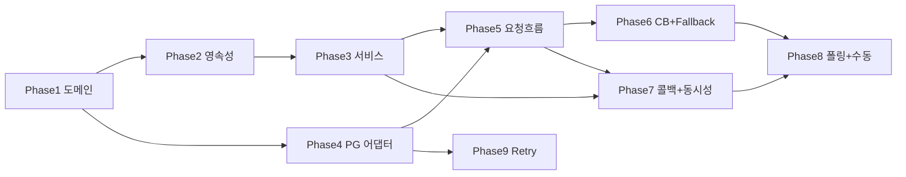

# 결제 도메인 구현 태스크 (Payment Implementation Tasks)

> 본 문서는 [[payment-implementation-plan]] 을 **작고 테스트로 검증 가능한 단위**로 쪼갠 작업 목록이다.
> 분해 기준(단일 축): **"이 태스크 하나가 끝났을 때, 그것만으로 통과하는 테스트를 쓸 수 있는가?"**
> 각 태스크는 `산출물`(파일) / `검증`(테스트) / `의존`(선행 태스크)을 가진다. 테스트 종류는 CLAUDE.md 레이어 전략(Domain=단위, Facade/Repository=통합, Controller=E2E)을 따른다.

> [!note] 표기
> - `검증` 의 테스트 클래스명은 제안이다. 단위는 접미사 없이(`PaymentModelTest`), 통합은 `IntegrationTest` 접미사.
> - 의존 표기는 **반드시 먼저 끝나야 하는** 태스크만 적는다. 같은 Phase 안에서도 병렬 가능한 것은 의존을 비워 둔다.

---

## Phase 1 — 도메인 골격 (외부 의존성 없음)

순수 Java 단위 테스트로 끝까지 검증 가능한 영역부터 시작한다. PG·DB 없이 도메인 규칙을 못 박는다.

- [ ] **T1.1 `CardType` enum**
  - 산출물: `domain/payment/CardType.java` (`SAMSUNG`, `KB`, `HYUNDAI`)
  - 검증: 별도 테스트 불필요(다른 태스크 테스트에서 사용)
  - 의존: 없음

- [ ] **T1.2 `PaymentStatus` 상태 머신 enum**
  - 산출물: `domain/payment/PaymentStatus.java` (`PENDING/PAID/FAILED/UNKNOWN`, `isTerminal()`)
  - 검증: `PaymentStatusTest` — `isTerminal()` 이 `PAID`/`FAILED` 에 `true`, `PENDING`/`UNKNOWN` 에 `false`
  - 의존: 없음

- [ ] **T1.3 `PaymentModel` 생성 + 자기 검증 + 카드 마스킹**
  - 산출물: `domain/payment/PaymentModel.java` (`@Entity extends BaseEntity`), 정적 팩토리 `pending(...)`
  - 내용: 필드 정의, 생성 시 `PENDING`, `amount > 0`·카드번호 형식 위반 시 `CoreException(BAD_REQUEST)`, 카드번호 마스킹(`1234-****-****-1451`)
  - 검증: `PaymentModelTest` — 유효 입력 시 `PENDING` 생성 / `amount<=0`·잘못된 카드번호 시 `CoreException(BAD_REQUEST)` / `cardNo` 가 마스킹되어 저장
  - 의존: T1.1, T1.2

- [ ] **T1.4 `PaymentModel` 상태 전이 메서드 (terminal 불변)**
  - 산출물: `markPaid(transactionKey)`, `markFailed(reason)`, `markUnknown()`, `attachTransactionKey(key)`
  - 검증: `PaymentModelTest` — `PENDING→PAID/FAILED/UNKNOWN` 정상 / **terminal(PAID·FAILED)에서 재전이 시도 시 멱등 무시 또는 `CoreException`** / `attachTransactionKey` 후에도 `PENDING` 유지
  - 의존: T1.3

---

## Phase 2 — 영속성 (Testcontainers 통합)

Repository 와 조건부 UPDATE 는 실제 DB 거동이 핵심이므로 통합 테스트로 검증한다.

- [ ] **T2.1 `PaymentRepository` 포트 + `PaymentJpaRepository` + `RepositoryImpl`**
  - 산출물: `domain/payment/PaymentRepository.java`(인터페이스), `infrastructure/payment/PaymentJpaRepository.java`, `PaymentRepositoryImpl.java(@Component)`
  - 내용: `save`, `findById`, `findByTransactionKey`, `findActiveByOrderId`(status in PENDING,PAID), `findPendingOlderThan(threshold)`
  - 검증: `PaymentRepositoryIntegrationTest` — `save` 후 `findByTransactionKey`/`findActiveByOrderId` 재조회 / `findPendingOlderThan` 가 grace 경과분만 반환
  - 의존: T1.3

- [ ] **T2.2 조건부 UPDATE — `transitionToPaid` / `transitionToFailed`**
  - 산출물: `PaymentJpaRepository` 의 `@Modifying @Query`(JPQL, `WHERE id=? AND status='PENDING'`), 포트/구현 위임
  - 검증: `PaymentRepositoryIntegrationTest` — **PENDING 행 전이 시 affected=1**, **이미 terminal 인 행 전이 시 affected=0** / `@Modifying(clearAutomatically=true)` 후 재조회로 상태 반영 확인
  - 의존: T2.1

> [!note] T2.3 (선택·강화) "활성 결제 1건" 부분 unique 제약
> MySQL 은 부분 unique 인덱스를 직접 지원하지 않으므로, 멀티 인스턴스 백스톱이 필요하면 생성 컬럼/별도 키 전략을 검토한다. **과제 범위에선 T4.1 의 진입 시 `findActive` 멱등만으로 충분**하므로 기본 미구현, 필요 시 별도 태스크로 승격.

---

## Phase 3 — 도메인 서비스 (Tx 경계)

- [ ] **T3.1 `PaymentService.createPending` (Tx1)**
  - 산출물: `domain/payment/PaymentService.java(@Component)`, `createPending(order, cardType, cardNo)` `@Transactional`
  - 검증: `PaymentServiceTest`(Repository mock) — `PENDING` Payment 가 저장 인자로 전달되는지 반환값/상태로 단언
  - 의존: T1.3, T2.1

- [ ] **T3.2 `PaymentService.attachTransactionKey` (Tx2) / `markUnknown` / `findPendingForReconcile`**
  - 산출물: 위 메서드들(`attachTransactionKey` `@Transactional`)
  - 검증: `PaymentServiceTest`(Repository mock) — 각 메서드가 올바른 전이/조회를 위임하는지
  - 의존: T3.1

- [ ] **T3.3 `PaymentService.confirm` (Tx3) — 무결성 가드 + 조건부 UPDATE**
  - 산출물: `confirm(transactionKey, status, reason, amount, cardNo)` `@Transactional`
  - 내용: 대상 조회 → **`amount`·`cardNo` 불일치 시 전이 거부 + `markUnknown`** → 일치 시 조건부 UPDATE → **affected=1일 때만 후처리 트리거 신호 반환**(0이면 스킵)
  - 검증: `PaymentServiceTest`(Repository mock) — 일치+PENDING → 전이/후처리 신호 / 불일치 → UNKNOWN 격리·전이 안 함 / affected=0 → 후처리 스킵
  - 의존: T2.2, T3.2

---

## Phase 4 — PG 포트 / 어댑터 (Resilience 진입점)

- [ ] **T4.1 PG 예외 타입**
  - 산출물: `domain/payment/PaymentGatewayException.java`, `PaymentGatewayTimeoutException.java`(전자 상속)
  - 검증: 별도 테스트 불필요(T4.4 변환 테스트에서 사용)
  - 의존: 없음

- [ ] **T4.2 `PaymentGateway` 포트 + domain DTO**
  - 산출물: `domain/payment/PaymentGateway.java`(`request`/`findByTransactionKey`/`findByOrderId`), `PgTransaction`(+`amount`), `PgPaymentCommand`
  - 검증: 컴파일/타입 계약(별도 테스트 없음)
  - 의존: T1.2

- [ ] **T4.3 `PaymentGatewayFeignClient` + Feign DTO + 타임아웃/Retryer 설정**
  - 산출물: `infrastructure/payment/PaymentGatewayFeignClient.java`, Feign DTO(`PgPaymentRequest`/`PgApiResponse<T>` 등), `PaymentGatewayFeignConfig`(`Retryer.NEVER_RETRY`), `application.yml` 의 `feign.client.config.pgSimulator`(connect 1000/read 2000), `payment-gateway.*`
  - 검증: 통합(선택) — WireMock 으로 200 응답 역직렬화 확인
  - 의존: 없음

- [ ] **T4.4 `PaymentGatewayImpl` 어댑터 — 예외 분기 변환 + status 매핑**
  - 산출물: `infrastructure/payment/PaymentGatewayImpl.java(@Component)`
  - 내용: 5xx·Connect Timeout → `PaymentGatewayException` / Read Timeout → `PaymentGatewayTimeoutException` / 4xx → `CoreException(BAD_REQUEST)` / PG status → 우리 `PaymentStatus` 매핑. **`fallbackMethod` 미사용**(예외 그대로 전파)
  - 검증: `PaymentGatewayImplTest` — 각 Feign 예외 입력 → 기대 도메인 예외 타입 / status 매핑(`SUCCESS→PAID` 등)
  - 의존: T4.1, T4.2, T4.3

---

## Phase 5 — 주문 결합 + 결제 요청 흐름

- [ ] **T5.1 주문 도메인 확장**
  - 산출물: `OrderStatus` 에 `PAID`/`PAYMENT_FAILED` 추가, `OrderService` 에 `getByOrderNumberAndValidateOwner`, `markPaid`, `markPaymentFailed`
  - 검증: `OrderServiceTest`/통합 — 소유자 불일치 시 예외, 상태 전이 반영
  - 의존: 없음(주문 도메인 독립)

- [ ] **T5.2 `PaymentFacade.pay` — Tx 분리 + 멱등 + PG 예외 시 PENDING 유지**
  - 산출물: `application/payment/PaymentFacade.java(@Component, 비트랜잭션)`, `PaymentInfo` record
  - 내용: 주문 검증 → `findActive` 멱등 반환 → `createPending`(Tx1) → 트랜잭션 밖 PG 호출 → `attachTransactionKey`(Tx2) / `PaymentGatewayException` catch → PENDING 유지
  - 검증: `PaymentFacadeIntegrationTest`(Testcontainers + `PaymentGateway` Fake) — 정상: `transactionKey` 저장됨 / **PG 미도달 예외: Payment 가 PENDING·`transactionKey=null` 로 DB 잔류** / 활성 결제 존재 시 PG 재호출 없이 멱등 반환
  - 의존: T3.1, T3.2, T4.2, T5.1

- [ ] **T5.3 결제 요청 API `POST /api/v1/payments`**
  - 산출물: `interfaces/api/payment/PaymentV1Controller.java`, `PaymentV1Dto`(`PaymentRequest`(amount 없음)/`PaymentResponse`), `PaymentV1ApiSpec`
  - 검증: E2E(`RANDOM_PORT`) — 성공: **202 + PENDING 응답 및 DB 영속 상태** / 실패(잘못된 입력): 상태 코드
  - 의존: T5.2

- [ ] **T5.4 결제 조회 API `GET /api/v1/payments/{id}` (클라이언트 폴링)**
  - 산출물: 컨트롤러 `get` 메서드, `PaymentStatusResponse`(`paymentId/orderNumber/status/failureReason`), 소유자 검증
  - 검증: E2E — 본인 결제 조회 시 현재 `status` 노출 / 타인 결제 조회 시 거부
  - 의존: T5.2

---

## Phase 6 — CircuitBreaker + Fallback (Must-Have 완성)

- [ ] **T6.1 resilience4j CB 설정 + 어댑터 적용**
  - 산출물: `application.yml` `resilience4j.circuitbreaker.instances.paymentRequest`/`paymentQuery`(설계 §7.2 값), 어댑터에 `@CircuitBreaker(name="paymentRequest")`(요청)/`("paymentQuery")`(조회)
  - 검증: 통합 — `record-exceptions`(상위 타입) 집계, `ignore-exceptions`(CoreException) 무시 동작
  - 의존: T4.4

- [ ] **T6.2 Fallback — CB OPEN 시 PENDING "처리 중"**
  - 산출물: `PaymentFacade.pay` catch 에 `CallNotPermittedException` 포함 → PENDING 유지
  - 검증: `PaymentFacadeIntegrationTest` — CB 강제 OPEN(연속 실패 주입) 후 호출 시 **PG 미호출 + Payment PENDING 잔류 + "처리 중" 반환**
  - 의존: T5.2, T6.1

---

## Phase 7 — 콜백 + 동시성

- [ ] **T7.1 콜백 수신 API `POST /api/v1/payments/callback` (공개)**
  - 산출물: 컨트롤러 `callback`, `CallbackRequest`(PG `TransactionInfo` 전체 필드 수신), 인증 인터셉터 화이트리스트 등록
  - 검증: E2E — 로그인 헤더 없이 200 OK / `SUCCESS` 콜백 → 해당 Payment `PAID`
  - 의존: T3.3, T5.2

- [ ] **T7.2 콜백 무결성 가드 (amount·cardNo 불일치 → UNKNOWN)**
  - 산출물: 콜백 핸들러 → `confirm(...)` 무결성 가드 경유
  - 검증: `통합` — `amount` 또는 `cardNo` 불일치 콜백 → **전이 거부 + Payment `UNKNOWN` 격리**(PAID 안 됨) DB 단언
  - 의존: T3.3, T7.1

- [ ] **T7.3 콜백·폴링 동시성 — 후처리 정확히 1회**
  - 산출물: 후처리(주문 확정)를 affected=1 분기에만 연결
  - 검증: `통합` — 같은 Payment 에 콜백+폴링 동시 confirm → **주문 확정 후처리 1회만** 실행(조건부 UPDATE), `assertDoesNotThrow` + 상태 단언
  - 의존: T3.3, T5.1

---

## Phase 8 — 폴링 + 수동 복구

- [ ] **T8.1 폴링 스케줄러**
  - 산출물: `@EnableScheduling`, 폴링 컴포넌트(`@Scheduled(fixedDelay=5000)`), grace 10s 대상 조회 → `transactionKey`/`orderNumber` 로 PG 조회 → 분기 처리
  - 분기: SUCCESS/FAILED → `confirm` / 처리 중 → 스킵 / **주문 없음(미도달) → FAILED 확정(자동 재요청 ❌)** / `createdAt` 10분 초과 → `markUnknown`
  - 검증: `폴링 IntegrationTest`(Fake/WireMock) — 5개 시나리오(SUCCESS·FAILED·처리중·주문없음·상한초과) 각각 기대 상태로 수렴
  - 의존: T3.3, T4.4, T6.1

- [ ] **T8.2 수동 복구 API `POST /api/v1/payments/{id}/reconcile`**
  - 산출물: 컨트롤러 `reconcile`(관리자), UNKNOWN/오래된 PENDING 강제 재조회·확정
  - 검증: E2E/통합 — UNKNOWN 건 reconcile 호출 → PG 조회 결과대로 확정
  - 의존: T8.1

---

## Phase 9 — Retry (Nice-To-Have)

- [ ] **T9.1 resilience4j Retry 설정 + 적용**
  - 산출물: `application.yml` `resilience4j.retry.instances.paymentRequest`(`retry-exceptions=PaymentGatewayException`, `ignore-exceptions=PaymentGatewayTimeoutException, CoreException`, backoff+jitter), 어댑터 `@Retry(name="paymentRequest")`
  - 검증: `통합` — **미도달(5xx) → 재시도 발생**(시도 횟수 관찰) / **Read Timeout → 재시도 없음**(PENDING 유지) / 4xx → 재시도 없음
  - 의존: T4.4

---

## 의존성 흐름 (요약)

- **Must-Have(Fallback/Timeout/CircuitBreaker)** 는 Phase 6 까지에서 완성된다.
- **Nice-To-Have(Retry)** 는 Phase 9 로 분리해 핵심 경로 검증 후 마지막에 얹는다.
- 각 Phase 의 통합/E2E 테스트가 모두 녹색이면 그 Phase 는 독립 PR 로 머지 가능하다.

---

## 관련 문서
- [[payment-implementation-plan]] — 분해 원본 계획
- [[payment-design]] — 설계 원본
