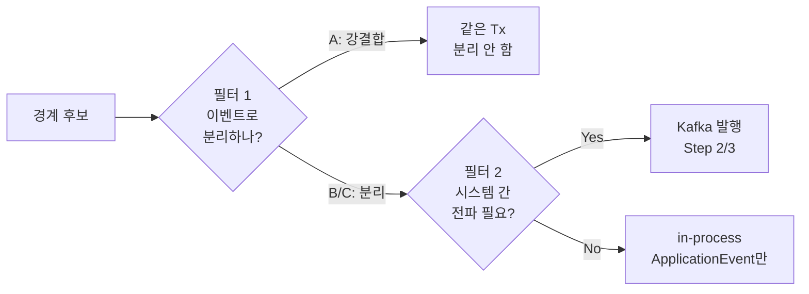
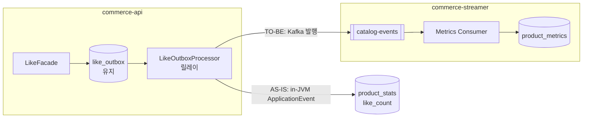
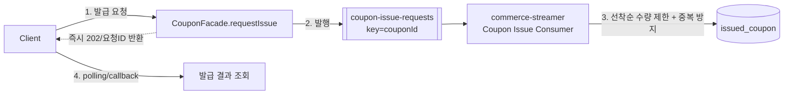

# Round 7 — 체크리스트 기반 이벤트 적용 지점 & 신규 도메인 지도

`round7-quests.md`의 Step 1~3 Checklist를 만족하려면 **어디에** 이벤트를 붙이고 **무엇이 새로** 생기는지를 코드 기준으로 환산한 실행 지도다. "왜 여기에 경계가 있는가"(A/B/C 판단)는 [step1-application-event-boundary.md](./step1-application-event-boundary.md)가 다루고, 이 문서는 그 판단을 **체크리스트 → `file:method` → 신규/기존 → 이벤트·토픽 → 판정**으로 옮긴다.

## 0. 두 개의 필터 — 헷갈리면 여기서 틀린다

경계 후보는 **두 번** 걸러진다. 이 둘을 섞으면 문서가 조용히 틀어진다.



- **필터 1 — 이벤트로 분리하는가?** = step1의 A/B/C. **A(강결합)는 애초에 이벤트가 아니다.** 재고 차감·결제 확정·주문 상태 전환은 같은 트랜잭션에 남는다.
- **필터 2 — Kafka로 보내는가?** = Step 2 Checklist의 첫 항목 "**시스템 간 전파가 필요한 이벤트만** Kafka로." 프로세스 내부에서 끝나는 부가효과는 이벤트로 분리하더라도 **in-process `ApplicationEvent`에 남는다.**

| 이벤트 | 분리? | 전파? | 결론 |
|---|---|---|---|
| 좋아요 수 / 판매량 / 조회수 집계 | B | **Yes** (commerce-streamer가 집계) | **Kafka** |
| 쿠폰 발급 요청 | (재배치) | **Yes** (consumer가 발급) | **Kafka** |
| 유저 행동 로깅 | B or C | **Yes** (streamer가 적재) | **Kafka** |
| 캐시 무효화 | C | **No** (commerce-api 자기 캐시) | **추후 도입 목표로 보류 — 이벤트·리스너 전부 삭제됨(§1.1)** |
| 주문/결제 알림 | C | 정책상 보통 No | in-process(또는 알림 전용 채널) |

> **가장 흔한 실수:** Step 1에서 뽑은 이벤트를 전부 Kafka로 밀어넣는 것. 캐시 무효화는 commerce-api 자기 자신의 Redis를 지우는 일이라 브로커를 탈 이유가 없다. Kafka 대상은 "**다른 시스템(commerce-streamer / 쿠폰 consumer)이 소비해야 하는 사실**"로 한정된다.

---

## 1. Step 1 — ApplicationEvent 경계 분리

Checklist 4항목을 적용 지점으로 환산한다. 상세 판단 근거는 step1 문서 §2 참조.

| # | Checklist | 적용 지점 (`file:method`) | 신규/기존 | 이벤트 | phase / 실행 | 판정 |
|---|---|---|---|---|---|---|
| 1-a | 주문–결제 부가 로직 분리 | `OrderFacade.createOrder` | **완료** | `OrderCreatedEvent`(§1.1) | `AFTER_COMMIT` | C |
| 1-a | 〃 (결제 알림/로깅) | `PaymentFacade.confirmResolved` | **신규** | `PaymentResultEvent`(가칭) | `AFTER_COMMIT` + 결과값 분기 | C |
| 1-b | 좋아요 처리·집계 분리 (집계 실패와 무관하게 좋아요 성공) | `LikeFacade.like/unlike` → `LikeOutboxEventListener`(①②) → `LikeOutboxProcessor`(③) → `LikeFacade.reflectLikeCountChange` | **완료** (표준형 ①기록/②fast-path/③릴레이로 재구성, §1.1) | `LikeChangedEvent` | `BEFORE_COMMIT`(①) + `@Async AFTER_COMMIT`(②) + `@Scheduled 1s`(③) | B |
| 1-c | 유저 행동 로깅(조회·클릭·좋아요·주문)을 이벤트로 | 각 도메인 Facade 진입점 | **신규(전무)** | `UserActivityEvent`(가칭) | `AFTER_COMMIT` + `@Async` | B or C(§4) |
| 1-d | 동작 주체 분리 + 트랜잭션 상관관계 | — (전 항목에 phase 매핑으로 충족) | — | — | step1 §3 phase 표 | — |

**현재 구현된 이벤트:** `OrderCreatedEvent`(1-a, 완료 — 현재 구독 리스너는 없지만 발행은 유지, Step 2 판매량 집계가 여기 얹일 예정), `LikeChangedEvent`(1-b, 좋아요 outbox 표준형의 T1 트리거). **캐시 무효화 목적으로 만들었던 이벤트(`ProductCacheEvictEvent`, `BrandDeletedEvent`, `ProductDeletedEvent`, `ProductUpdatedEvent`, `ProductLikedEvent`, `ProductUnlikedEvent`)는 리스너와 함께 전부 삭제**하고 추후 도입 목표로 보류했다(§1.1). 즉 **1-a의 결제 이벤트와 1-c의 행동 로깅만 아직 코드에 없다** — Step 1에서 신규로 붙어야 한다.

**결제 실패 알림 주의(step1 §2.2):** `confirm()`의 `FAILED`는 예외가 아니라 **정상 커밋**이다. 따라서 실패 알림도 `AFTER_ROLLBACK`이 아니라 `AFTER_COMMIT` 안에서 `ConfirmOutcome.result()` 값으로 분기한다.

### 1.1 이벤트 경계 리팩터링 경위 — `OrderCreated`/좋아요 outbox는 유지, 캐시 무효화는 전부 삭제

**`createOrder`: command → fact (`OrderCreated`, 완료).** 원래 `createOrder`가 발행하던 `ProductCacheEvictEvent(productIds)`는 **event가 아니라 command에 가까웠다**(step1 §2.1 노트) — 이름이 반응(evict)을 지시하고 publisher가 캐시 정책을 이미 알고 있었다. `domain/order/OrderCreatedEvent`(fact) + `OrderEventPublisher`(포트) + `OrderCoreEventPublisher`(구현)로 전환 완료. 판매량 집계를 별도 이벤트로 새로 만들 필요 없이 `OrderCreated`에 **리스너만 얹으면** 된다(§2.1과 직결).

**좋아요 outbox: 표준형(①/②/③)으로 재구성 (완료).** `LikeFacade.like/unlike`가 도메인 쓰기 직후 `LikeChangedEvent(productId, eventType)`를 발행 → `LikeOutboxEventListener.record()`(`BEFORE_COMMIT`, ①)가 outbox에 기록 → 같은 클래스 `.send()`(`@Async AFTER_COMMIT`, ②)가 `LikeOutboxProcessor.process()`를 즉시 재호출(fast-path) → `process()`(`@Scheduled 1s`, ③)가 PENDING을 찾아 `LikeFacade.reflectLikeCountChange()`를 직접 호출해 카운트를 반영한다. `markDoneIfPending`으로 멱등이라 ②·③이 겹쳐도 안전. 기존 `LikeCountChangedEvent`(내부 폴링용, outboxId 포함)는 이 구조에서 완전히 대체되어 삭제됨.

**캐시 무효화 이벤트·리스너: 전부 삭제, 추후 도입 목표로 보류 (판단 두 차례 번복).** 경위:
1. `deleteBrand`/`deleteProduct`/`updateProductForAdmin`은 캐시 무효화가 유일 반응이라 공용 `ProductCacheEvictEvent`(command) 유지로 판단.
2. 논의 끝에 `BrandFacade`가 `product` 패키지 이벤트를 발행하는 도메인 소유권 문제 + command성 이름 문제로, **발행 지점별 fact**(`BrandDeletedEvent`/`ProductDeletedEvent`/`ProductUpdatedEvent`/`ProductLikedEvent`/`ProductUnlikedEvent`)로 전부 전환하고 `ProductCacheEvictEvent` 삭제.
3. 좋아요 쪽에서 "`ProductLikedEvent`를 T1(등록 시점)에 발행할지 T2(카운트 반영 후)에 발행할지" 타이밍 논의가 길어졌고, 캐시 무효화가 지금 당장 필요한 기능이 아니라는 판단 하에 **`ProductCacheEvictListener` 자체를 삭제**.
4. 최종적으로 **캐시 무효화를 위해서만 만들었던 이벤트·포트·구현까지 전부 삭제**(`BrandDeletedEvent`·`BrandEventPublisher`·`BrandCoreEventPublisher`, `ProductDeletedEvent`·`ProductUpdatedEvent`·`ProductEventPublisher`·`ProductCoreEventPublisher`, `ProductLikedEvent`·`ProductUnlikedEvent`). `ProductCacheStore.evictProduct`/`evictAll` 같은 인프라 유틸 자체는 남겨뒀다 — 나중에 재사용 가능. 캐시는 지금 TTL(`PRODUCT_TTL=5분`/`LIST_TTL=30초`)로만 정합성을 회복한다.

**추후 도입 시 주의**: 좋아요는 "눌림"(T1, 등록 시점)과 "카운트 실제 반영"(T2, `reflectLikeCountChange` 이후)이 다른 시점이다. 캐시는 T2 이후에 지워야 의미가 있으므로, T1에 발행되는 `LikeChangedEvent`류를 캐시 무효화 트리거로 재사용하지 말 것.

### 1.2 이벤트 관련 패키지 배치 — `apps/pg-simulator` 기준

이벤트 객체·퍼블리셔·리스너·릴레이의 패키지 위치는 레포의 **`apps/pg-simulator`** 모듈을 표준으로 삼는다(payment 도메인이 이미 이 구조로 구현돼 있다). 헥사고날 + DIP를 그대로 따른다.

| 요소 | 위치 | 성격 | pg-simulator 예시 |
|---|---|---|---|
| **이벤트 객체(fact)** | `domain/<도메인>/` | 도메인 어휘. 과거형 사실 | `domain/payment/PaymentEvent`(`object` + 중첩 `PaymentCreated`/`PaymentHandled` + `from()` 팩토리) |
| **퍼블리셔 포트** | `domain/<도메인>/` | 도메인이 의존하는 추상(port) | `domain/payment/PaymentEventPublisher` (interface) |
| **퍼블리셔 구현** | `infrastructure/<도메인>/` | Spring `ApplicationEventPublisher`를 감싸는 어댑터 | `infrastructure/payment/PaymentCoreEventPublisher` |
| **리스너** | `interfaces/event/<도메인>/` | 인바운드 어댑터. **얇게** — application/domain에 위임 | `interfaces/event/payment/PaymentEventListener` → `PaymentApplicationService` 위임 |
| **릴레이/전송 포트** | `domain/<도메인>/` | 아웃바운드 추상(port) | `domain/payment/PaymentRelay` (interface) |
| **릴레이/전송 구현** | `infrastructure/<도메인>/` | 아웃바운드 어댑터(HTTP/Kafka) | `infrastructure/payment/PaymentCoreRelay` (RestTemplate) |

**세 가지 원칙:**

1. **도메인은 Spring API를 모른다(DIP).** 발행 지점(Facade/도메인 Service)은 도메인 포트 `XxxEventPublisher`를 호출하고, `ApplicationEventPublisher`는 **infra 구현에만** 등장한다.
   > ✅ 완료(현재 남은 것만). `OrderFacade`는 `OrderEventPublisher`, `LikeFacade`는 `LikeEventPublisher`(현재 `LikeChangedEvent` 전용) 포트로 발행하고, `ApplicationEventPublisher`는 `infrastructure/order/OrderCoreEventPublisher`·`infrastructure/like/LikeCoreEventPublisher`에만 등장한다. `BrandEventPublisher`/`ProductEventPublisher`와 그 구현체는 캐시 무효화 전용이라 §1.1에서 이벤트째로 삭제됐다.
2. **리스너는 얇은 인바운드 어댑터.** `interfaces/event/<도메인>/`에 두고, 이벤트를 풀어 application service/domain service를 호출만 한다. 비즈니스 로직(집계·상태 변경)을 리스너 본문에 두지 않는다.
   > ✅ 완료. `LikeOutboxEventListener`를 `interfaces/event/like/`로 옮기고, `markDoneIfPending`·`increase/decreaseLikeCount`·fact 발행 로직은 `LikeFacade.reflectLikeCountChange()`로 내려보냈다(여러 도메인 조합이라 domain Service가 아닌 application Facade에 배치).
3. **아웃바운드는 infra.** Kafka 발행/HTTP 콜백 같은 전송은 릴레이 포트(domain) + 구현(infra)으로 둔다. 리스너와 한 곳에 섞지 않는다.

**commerce-api 적용 예 (`OrderCreated`):**

```
domain/order/
  OrderCreatedEvent                  ← 사실(fact)
  OrderEventPublisher (interface)    ← 퍼블리셔 포트
infrastructure/order/
  OrderCoreEventPublisher            ← 포트 구현(Spring ApplicationEventPublisher 래핑)
  OrderEventRelay                    ← (Step 2) Kafka 발행 아웃바운드
interfaces/event/product/
  (제거됨) ProductCacheEvictListener  ← 캐시 무효화 반응은 추후 도입 목표로 보류(§1.1 갱신)
  (Step 2) 판매량 집계 리스너         ← 반응(집계), 얇게 → 집계 service 위임
application/order/
  OrderFacade                        ← OrderEventPublisher 포트로 발행
```

---

## 2. Step 2 — Kafka 이벤트 파이프라인

### 2.1 집계는 하나가 아니라 셋 — 그중 하나만 구현돼 있다

Step 2 목표는 **좋아요 수 · 판매량 · 조회 수** 세 집계를 `product_metrics`로 모으는 것이다. 현재 구현된 건 좋아요뿐이고, 그마저도 in-JVM 집계라 Kafka로 이관해야 한다.

| 집계 | 이벤트 발생 지점 (`file:method`) | 신규/기존 | 이벤트(가칭) | 토픽 (partition key) |
|---|---|---|---|---|
| 좋아요 수 | `LikeFacade.like/unlike` → 좋아요 outbox | **기존** (in-JVM → **Kafka로 이관**) | `LikeCountChangedEvent` → **`ProductLiked`/`ProductUnliked`**(§2.5) | `catalog-events` (key=`productId`, **순서 보장 필수**) |
| 판매량 | `OrderFacade.createOrder` | **신규 리스너** (§1.1: `OrderCreated`의 리스너로 통합) | `OrderCreated` | `order-events`(원천, key=`orderId`) → 집계 |
| 조회 수 | `ProductFacade.getProduct` | **신규 경계** (step1 §2.4) | `ProductViewedEvent` | `catalog-events` (key=`productId`) |

> **좋아요 flow가 Step 2를 이미 덮는다고 오해하지 말 것.** 좋아요 outbox는 *발행 인프라 패턴*의 선례일 뿐, 집계 대상 셋 중 하나다. 판매량·조회수는 **경계만 존재**하고 이벤트·outbox·consumer가 전부 신규다.

### 2.2 `product_stats` → `product_metrics`: 이건 마이그레이션이다

지금 좋아요 수는 commerce-api의 `product_stats`(컬럼 `like_count`)에 **in-JVM으로** 적재된다(`LikeOutboxEventListener`가 `productStatsService.increaseLikeCount()` 호출). Step 2는 이 집계를 **시스템 밖**(commerce-streamer의 `product_metrics`)으로 옮긴다.



바뀌는 것:
- **like outbox는 그대로 유지** — at-least-once 보증은 여전히 필요하다.
- 릴레이(`LikeOutboxProcessor`)의 발행 대상이 **in-JVM 이벤트 → Kafka**로 바뀐다.
- 집계 로직(`increaseLikeCount`)이 **commerce-streamer consumer로 이동**한다.

> **⚠️ 열린 결정 (§5):** `product_stats`를 폐기할지, commerce-api의 **로컬 read model**로 유지할지는 설계 판단이다. 상품 조회 응답이 좋아요 수를 즉시 보여줘야 한다면 `product_stats`를 남기고 `product_metrics`는 streamer 전용 집계로 이원화할 수 있다. 이 문서는 결정을 강제하지 않고 열어둔다.

### 2.3 `event_handled` ≠ 로그 테이블 — 둘 다 신규, 목적이 다르다

퀘스트가 명시적으로 "**왜 이벤트 핸들링 테이블과 로그 테이블을 분리하나**"를 묻는다. 둘은 별개의 신규 테이블이다.

| 테이블 | 목적 | 키 | 성격 |
|---|---|---|---|
| `event_handled` | **멱등 처리** — 이 event_id를 이미 소비했는가 | `event_id` (PK) | 제어용. row는 "처리됨" 마킹만 |
| `event_log` (또는 metrics 원천 로그) | **실제 데이터 적재** — 무슨 일이 언제 일어났나 | auto id | 데이터용. 1-c 유저 행동 로깅이 여기로 |

분리 이유: 멱등 체크는 소비 경로의 **뜨거운 조회**(있나/없나)라 작고 빠른 인덱스여야 하고, 로그는 **계속 쌓이는 append-only 데이터**다. 성격·수명·조회 패턴이 달라 한 테이블에 섞으면 멱등 조회가 로그 볼륨에 눌린다.

### 2.4 Step 2 Checklist → 구현 지점

| Checklist | 구현 지점 | 신규/기존 |
|---|---|---|
| 시스템 간 전파 이벤트를 Kafka 발행 | commerce-api 릴레이 → `KafkaTemplate` | **신규** (commerce-api에 `modules:kafka` 의존성 자체가 없음) |
| `acks=all`, `idempotence=true` | `modules/kafka/kafka.yml` producer 블록 | **신규** (현재 `retries:3`만, acks 기본값 1) |
| Transactional Outbox | like outbox 패턴 재사용 + 판매량·조회수용 신규 outbox | 기존 패턴 / 신규 인스턴스 |
| PartitionKey 기반 순서 보장 | `catalog-events` key=`productId`, `order-events` key=`orderId` | **신규** (토픽·키 설계) |
| Consumer가 metrics 집계 upsert | commerce-streamer 신규 consumer → `product_metrics` | **신규** |
| `event_handled` 멱등 처리 | commerce-streamer 신규 테이블·체크 | **신규** |
| manual Ack + `version`/`updated_at` 최신만 반영 | consumer 리스너 설정 + upsert 조건 | 부분(manual ack는 `modules:kafka`에 설정됨) |

### 2.5 좋아요 이벤트: command → fact + 순서 보장 (`ProductLiked`/`ProductUnliked`)

> **Step 1에서 한 번 만들었다가 삭제됨 — Step 2 진입 시 다시 필요하다.** `LikeFacade.reflectLikeCountChange()`가 카운트 반영 직후 `ProductLikedEvent`/`ProductUnlikedEvent(productId)`를 발행하도록 만들었으나, 유일한 소비자가 캐시 무효화 리스너뿐이었고 그 리스너를 추후 도입 목표로 보류하면서 **이 fact 이벤트 자체도 함께 삭제**했다(§1.1). Step 2에서 좋아요를 Kafka로 이관할 때는 이 fact를 다시 만들어야 한다 — 이번엔 소비자가 commerce-streamer 집계 consumer라 명확하다.

현재 좋아요 outbox의 T1 트리거인 `LikeChangedEvent`(§1.1)를 그대로 Kafka 페이로드로 밀어넣지 말 것. 진짜 사실은 `LikeEventType`에 이미 있는 **좋아요 눌림/취소**이므로, Kafka로 나가는 fact는 `ProductLiked`/`ProductUnliked`(또는 방향을 담은 단일 `ProductLikeChanged`)처럼 **카운트가 실제로 반영된 뒤**(`reflectLikeCountChange` 이후, T2) 발행해야 한다. `outboxId` 같은 내부 식별자를 페이로드에 싣지 말 것 — dedup은 Step 2에서 `event_handled(event_id)`로 처리한다.

**좋아요 취소가 "순서 보장" 체크리스트 항목의 근거다.** 같은 상품의 `LIKED` → `UNLIKED`가 역순 처리되면 decrease가 increase보다 먼저 반영돼 카운트가 틀어진다. in-JVM 단일 폴러에선 안 드러나지만 Kafka로 넘기면 **partition key=`productId`로 같은 상품 이벤트를 같은 파티션에 몰아** 순서를 보장해야 한다. 여기에 `event_handled`(멱등)와 `updated_at`/`version` 기준 최신 반영이 더해져야 취소·중복·역순이 모두 방어된다.

패키지 배치는 §1.2를 따른다 — `ProductLiked`/`ProductUnliked`는 `domain/like/`, 퍼블리셔 포트도 `domain/like/`(구현은 `infrastructure/like/`), 집계 리스너는 `interfaces/event/`에 두고 로직은 집계 service로 위임한다.

---

## 3. Step 3 — Kafka 기반 선착순 쿠폰 발급

현재 `CouponFacade.issue`는 **동기 트랜잭션(A)** 이다(수량 차감·중복 방지 정합성). Step 3는 이걸 "**API는 요청만 발행, consumer가 실제 발급**"으로 재배치한다.



| Checklist | 구현 지점 | 신규/기존 |
|---|---|---|
| 발급 요청 API → Kafka 발행(비동기) | `CouponFacade` 신규 `requestIssue` (기존 동기 `issue`는 consumer 내부 로직으로 이전) | **신규/재배치** |
| Consumer 선착순 수량 제한 + 중복 방지 | commerce-streamer 신규 Coupon consumer | **신규** |
| 발급 결과 확인 구조(polling/callback) | 발급 요청 상태 테이블 + 조회 API | **신규** |
| 동시성 테스트 (수량 초과 방지 검증) | consumer 동시성 제어 + 테스트 | **신규** |

**동시성 제어 후보(step1 §2.4 + 기존 인프라):** `IssuedCouponModel`은 이미 `@Version`(낙관 락)과 UK `(coupon_template_id, user_id)`(중복 방지)를 보유. 선착순 수량 제한은 (a) `CouponTemplate`의 잔여 수량 원자적 UPDATE, 또는 (b) `modules:redis`를 이용한 카운터/`DECR` 중 택1 — CLAUDE.md 동시성 전략상 **원자적 UPDATE 우선**.

---

## 4. 유저 행동 로깅이 B와 C를 오가는 이유 (1-c 보충)

step1 §4와 동일 판단: 같은 "행동 로깅"이 요구사항에 따라 갈린다.

- **분석·추천용** → **C** (몇 건 유실 무방, `AFTER_COMMIT` best-effort)
- **감사·컴플라이언스용** → **B** (한 건도 유실 불가, outbox 내구성)

Step 2에서 로그를 Kafka로 전파해 `event_log`에 적재한다면, 그 내구성 수준(at-least-once 여부)이 이 판단을 따라간다.

---

## 5. 신규 추가물 종합표 — "어떤 도메인이 추가되는가"

| 계층/모듈 | 신규 추가물 | 소속 | 용도 | Step |
|---|---|---|---|---|
| 엔티티 | `ProductMetricsModel` (`product_metrics`) | commerce-streamer | 좋아요·판매량·조회수 upsert 집계 | 2 |
| 엔티티 | `EventHandledModel` (`event_handled`) | commerce-streamer | `event_id` 기반 멱등 처리 | 2 |
| 엔티티 | `EventLogModel` (`event_log`) | commerce-streamer | 유저 행동/이벤트 원천 로그 적재 | 1-c/2 |
| 엔티티 | 쿠폰 발급 요청/결과 상태 테이블 | commerce-api or streamer | 발급 결과 polling/callback | 3 |
| 이벤트(fact) | `OrderCreatedEvent` ✅완료(발행만, 리스너 없음) | `domain/order/` | 주문 사실 — 판매량 집계가 Step 2에서 얹일 예정(§1.1) | 1/2 |
| 이벤트(fact) | `LikeChangedEvent` ✅완료 | `domain/like/` | 좋아요 outbox 표준형의 T1 트리거(①기록/②fast-path 발동용)(§1.1) | 1 |
| 이벤트(fact) | `ProductLiked`/`ProductUnliked`(재도입 필요) | `domain/like/`(가칭) | Step 1에서 만들었다가 캐시 무효화와 함께 삭제. Step 2 Kafka 이관 시 T2(카운트 반영 후) 시점으로 다시 필요(§2.5) | 2 |
| (삭제됨) | `BrandDeletedEvent`/`ProductDeletedEvent`/`ProductUpdatedEvent` | `domain/brand/`, `domain/product/` | 캐시 무효화 전용으로 만들었다가 리스너와 함께 전부 삭제(§1.1) | — |
| 이벤트(fact) | `PaymentResultEvent`(가칭) | `domain/payment/` | 결제 성공/실패 알림·로깅 | 1 |
| 이벤트(fact) | `UserActivityEvent`(가칭) | `domain/<origin>/` | 유저 행동 로깅 | 1-c |
| 이벤트(fact) | `ProductViewedEvent`(가칭) | `domain/product/` | 조회수 집계 | 2 |
| 퍼블리셔 | `XxxEventPublisher` 포트 + `XxxCoreEventPublisher` 구현 | `domain/` + `infrastructure/` | DIP — Spring API를 infra에 숨김(§1.2) | 1 |
| 리스너 | 캐시·집계·알림·로깅·아웃박스 기록 리스너 | `interfaces/event/<도메인>/` | 얇은 인바운드 어댑터(§1.2) | 1/2 |
| outbox | 판매량·조회수용 outbox (like 패턴 재사용) | commerce-api | at-least-once 발행 | 2 |
| 의존성 | `modules:kafka` | **commerce-api** | producer 발행 (현재 의존성 없음) | 2 |
| 설정 | producer `acks=all` / `enable.idempotence=true` | `modules/kafka/kafka.yml` | At-Least/Exactly-Once 발행 | 2 |
| consumer | Metrics 집계 consumer | commerce-streamer | `product_metrics` upsert | 2 |
| consumer | Coupon Issue consumer | commerce-streamer | 선착순 발급 | 3 |
| consumer | (선택) 행동 로그 consumer | commerce-streamer | `event_log` 적재 | 1-c/2 |
| 토픽 | `catalog-events`(key=productId) / `order-events`(key=orderId) / `coupon-issue-requests`(key=couponId) | Kafka | 순서 보장 · 관심사 분리 | 2/3 |
| streamer 계층 | domain / infrastructure / application 계층 | commerce-streamer | 현재 `interfaces.consumer`(데모)만 존재 | 2 |

**commerce-streamer는 현재 스켈레톤이다** — `DemoKafkaConsumer` 하나뿐이고 domain/infra/application 계층이 없다. Step 2에서 실질적으로 새 앱을 채우는 셈이다. (퀘스트 문서의 `commerce-collector` = 이 레포의 `commerce-streamer`.)

---

## 6. 열린 결정 / 확인 필요

작성을 막지는 않지만 구현 전에 못 박아야 하는 것들.

1. **`product_stats` 운명 (§2.2)** — 폐기 vs commerce-api 로컬 read model 유지. 상품 조회가 좋아요 수를 즉시 보여줘야 하는지가 기준.
2. **`modules/kafka/kafka.yml` consumer value deserializer 오설정** — 조사 결과 `value-deserializer`여야 할 프로퍼티가 `value-serializer`로 들어가 있을 가능성. Step 2 소비 붙이기 전 확인 필요.
3. **판매량/조회수 outbox 위치** — like처럼 도메인별 전용 outbox를 둘지, step1 §3.1 표준형(`BEFORE_COMMIT` 기록 + `AFTER_COMMIT` @Async fast-path + 릴레이)의 공용 outbox로 통합할지.
4. **Nice-to-Have** — consumer group 분리(관심사별), consumer 배치 처리, DLQ 구성. 시간 허락 시.

---

## 7. 한 줄 요약

- **필터 둘을 분리하라**: "이벤트인가(A/B/C)"와 "Kafka인가(시스템 간 전파)"는 다른 질문이다. 캐시 무효화는 이벤트(C)지만 Kafka가 아니다.
- **집계는 셋(좋아요·판매량·조회수)**, 구현된 건 좋아요 하나, 그것도 Kafka로 이관 대상.
- **신규의 대부분은 commerce-streamer 쪽**: `product_metrics` · `event_handled` · `event_log` + consumer들. commerce-api엔 `modules:kafka` 의존성과 producer 배선이 새로 붙는다.
- **쿠폰은 A(동기) → 요청 발행 + consumer 발급으로 재배치**, 선착순은 원자적 UPDATE 우선.
