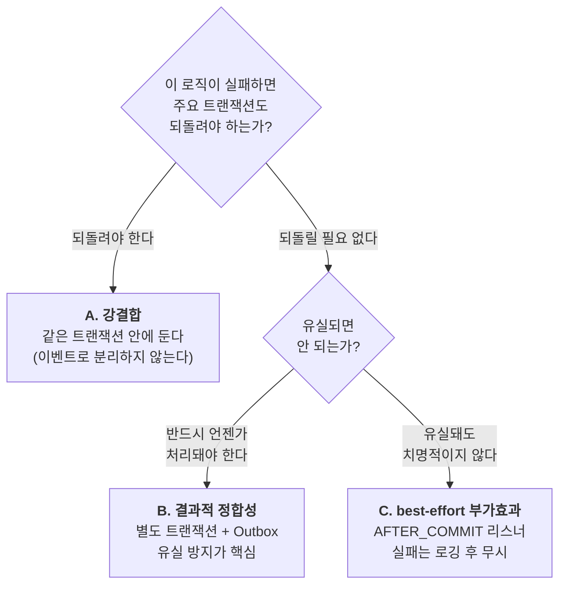
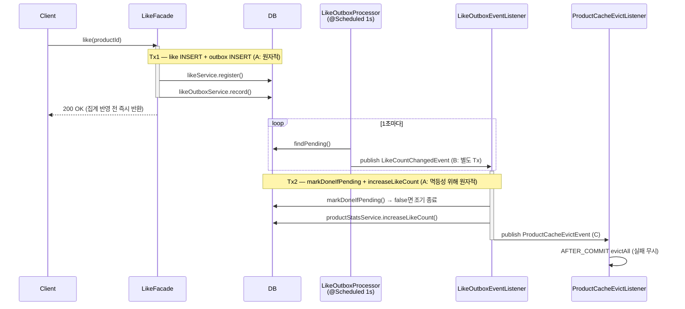

# Step 1 — ApplicationEvent 경계 분리 판단

commerce-api의 전체 도메인에서 "이 로직을 이벤트로 분리해야 하는가?"를 판단한다. 과제가 이름을 댄 주문·결제·좋아요를 중심으로 깊게 보고(§2.1~2.3), 나머지 도메인(brand·coupon·product·user·stock)까지 같은 축으로 훑는다(§2.4). 목표는 이벤트를 최대한 많이 뽑아내는 것이 아니라, **분리해야 하는 것과 분리하면 안 되는 것을 가르는 하나의 기준을 세우고 코드에 적용**하는 것이다.

## 1. 판단 축: 실패 결합도

경계 후보를 만날 때마다 던지는 질문은 하나다.

> **이 로직이 실패하면, 방금 커밋하려는 주요 트랜잭션은 어떻게 되어야 하는가?**

답은 세 갈래로 나뉘고, 이 셋은 "실패가 주요 트랜잭션에 얼마나 강하게 묶여 있는가"라는 단일 스펙트럼 위의 세 지점이다.



- **A. 강결합** — 실패 시 함께 롤백돼야 하는 로직. 재고 차감, 결제 상태 확정, 주문 상태 전환처럼 데이터 정합성이 걸린 것. 이벤트로 분리하면 원자성이 깨진다. → **같은 트랜잭션에 둔다.**
- **B. 결과적 정합성** — 주요 로직 성공을 막지는 않지만 언젠가는 **반드시** 반영돼야 하는 로직. 좋아요 수 집계가 대표적이다. 동기일 필요는 없으나 유실되면 카운트가 영영 틀어진다. → **별도 트랜잭션으로 분리하되 Outbox로 유실을 막는다.**
- **C. best-effort 부가효과** — 실패해도 주요 결과에 영향이 없고 유실도 감수할 수 있는 로직. 캐시 무효화, 알림, 분석용 행동 로깅. → **`@TransactionalEventListener(AFTER_COMMIT)`로 분리하고 실패는 삼킨다.**

이 축은 **경계마다 재귀적으로** 적용된다. 플로우 하나를 통째로 한 번 판정하는 것이 아니라, 플로우 안의 모든 지점에서 같은 질문을 반복한다. 아래 좋아요 플로우가 그 예다 — 하나의 플로우 안에 A·B·C가 모두 들어있다.

한 가지 더: 이벤트로 발행하는 것은 **이미 일어난 사실**(과거형 — "주문이 생성됐다", "좋아요 수가 바뀌었다")이다. publisher는 누가 그것을 소비하는지 몰라도 된다. 이 무지(無知)가 곧 분리가 성립하는 근거다. 반대로 주요 로직이 "그 결과를 반드시 확인해야" 한다면 그건 이벤트가 아니라 명령(command)이고, A에 속한다.

## 2. 현재 코드에 축 적용

### 2.1 주문 생성 — `OrderFacade.createOrder()`

```java
@Transactional
public OrderInfo createOrder(...) {
    UserModel user = userService.getLoginUser(loginId, loginPw);           // 인증
    Map<Long, ProductModel> productMap = productService.findAllByIdsOrThrow(productIds)...;
    // ... 가격 계산 ...
    if (issuedCouponId != null) {
        issuedCouponService.use(issued.getId());                           // 쿠폰 사용 (UPDATE)
    }
    orderItems.forEach(cmd -> stockService.decreaseStock(...));            // 재고 차감 (UPDATE)
    OrderModel saved = orderService.create(...);                          // 주문 생성 (INSERT)

    eventPublisher.publishEvent(new ProductCacheEvictEvent(productIds));   // 캐시 무효화 (이벤트)
    return OrderInfo.from(saved);
}
```

| 로직 | 판정 | 이유 |
|---|---|---|
| 쿠폰 사용 · 재고 차감 · 주문 생성 | **A** | 셋 중 하나라도 실패하면 나머지도 무효여야 한다. 재고는 깎였는데 주문이 없거나, 쿠폰만 소진되면 정합성이 깨진다. 같은 트랜잭션 필수. |
| 상품 캐시 무효화 | **C** | 캐시는 실패해도 TTL로 결국 정리된다. 이미 `ProductCacheEvictEvent`로 분리돼 있고 리스너는 `AFTER_COMMIT` + `try/catch`다. |
| 주문 완료 알림 · 유저 행동 로깅 | **C** (미구현) | 알림 발송이 실패해도 주문은 유효하다. 현재 코드에 없으나, 추가된다면 트랜잭션 안이 아니라 `AFTER_COMMIT` 리스너에 붙어야 한다. |

> **주의 — publish는 트랜잭션 안, 실행은 커밋 후.** `publishEvent`가 `@Transactional` 메서드 안에서 호출되지만, `ProductCacheEvictListener`가 `AFTER_COMMIT`이므로 실제 무효화는 커밋 후에 실행된다. 만약 주문이 롤백되면 이벤트는 발행됐어도 리스너가 뜨지 않는다 — 일어나지 않은 주문의 캐시를 지우지 않는다. 이 동작이 캐시 무효화가 C에 속한다는 판정과 정확히 맞물린다.

현재 알림·로깅이 없다는 것은 "판단할 게 없다"는 뜻이 아니다. **추가될 때 트랜잭션 안으로 끌고 들어오지 않는 것**이 이 축의 실전 가치다. 알림 전송을 `createOrder` 트랜잭션 안에서 동기 호출하면, 알림 서버 지연이 주문 트랜잭션의 커넥션 점유 시간을 늘리고 실패 시 정상 주문까지 롤백시킨다.

### 2.2 결제 확정 — `PaymentFacade.confirmResolved()`

결제 Facade의 `pay()`는 PG HTTP 호출을 트랜잭션 밖에 두려고 의도적으로 비트랜잭션이다(설계 §4). 반면 확정 경로는 다르다.

```java
// confirm(조건부 UPDATE) + 주문 후처리를 한 트랜잭션으로 묶어
// "결제는 PAID인데 주문은 미확정"인 crash gap을 막는다.
@Transactional
public ConfirmOutcome confirmResolved(...) {
    ConfirmOutcome outcome = paymentService.confirm(...);   // 결제 상태 전이 (조건부 UPDATE)
    applyOrderPostProcessing(outcome);                      // 주문 상태 전환
    return outcome;
}

private void applyOrderPostProcessing(ConfirmOutcome outcome) {
    switch (outcome.result()) {
        case PAID   -> orderService.markPaid(outcome.orderId());
        case FAILED -> orderService.markPaymentFailed(outcome.orderId());
        default     -> { /* SKIPPED / ISOLATED / STILL_PENDING → 후처리 없음 */ }
    }
}
```

| 로직 | 판정 | 이유 |
|---|---|---|
| 결제 상태 확정 + 주문 상태 전환 | **A** | 결제가 PAID로 확정됐는데 주문이 미확정이면 "돈은 빠졌는데 주문 없음"이 된다. 두 상태 전환은 반드시 같은 트랜잭션이어야 한다. 코드 주석의 crash gap 방어가 그 근거다. |
| 결제 성공/실패 알림 · 결제 로깅 | **C** (미구현) | 알림·로깅이 실패해도 결제·주문 확정은 유효하다. 추가된다면 `confirmResolved` 안이 아니라 이벤트로 분리해야 한다. |

**핵심 구분 — 비즈니스 실패 ≠ 트랜잭션 롤백.** `confirm()`의 `FAILED` 분기는 예외를 던지지 않는다. `ConfirmOutcome.failed(...)`를 반환하고 `markPaymentFailed`가 실행된 뒤 트랜잭션은 **정상 커밋**된다. 즉 "결제 실패"는 성공적으로 커밋된 결과다. 따라서 결제 실패 알림도 `AFTER_ROLLBACK`이 아니라 **`AFTER_COMMIT`**에 붙는다. 리스너는 커밋된 `ConfirmOutcome.result()`를 보고 성공/실패 메시지를 나눠 보내면 된다. `AFTER_ROLLBACK`은 예상치 못한 예외로 트랜잭션 자체가 깨진 경우에나 해당한다.

### 2.3 좋아요 집계 — Outbox + ApplicationEvent (축이 재귀적으로 적용되는 예)

좋아요 플로우는 세 판정이 한 흐름 안에 겹쳐 있다.



| 경계 | 판정 | 이유 |
|---|---|---|
| `likeService.register()` + `likeOutboxService.record()` (Tx1) | **A** | 좋아요 등록과 outbox 기록이 같은 트랜잭션이어야 이벤트 유실이 없다. 등록은 됐는데 outbox가 없으면 집계가 영영 누락된다. |
| 좋아요 등록 → 좋아요 수 집계 (Tx1 → Tx2 분리) | **B** | 집계는 좋아요 응답을 막을 필요가 없다(핫 상품에서 카운터 row 경합이 응답 경로에 들어오지 않게). 그러나 유실되면 카운트가 틀어지므로 Outbox로 at-least-once를 보장한다. |
| `markDoneIfPending()` + `increaseLikeCount()` (Tx2 내부) | **A** | 중복 발행에 대비한 멱등 처리와 실제 카운트 증가가 같은 트랜잭션이어야 한다. `markDoneIfPending`이 `false`면 조기 종료해 이중 반영을 막는다. |
| 캐시 무효화 (`ProductCacheEvictEvent`) | **C** | 2.1과 동일. `AFTER_COMMIT` + 실패 무시. |

현재 구현은 **Outbox row를 스케줄러가 1초마다 폴링 → 인프로세스 `ApplicationEvent`로 발행 → 리스너가 별도 트랜잭션에서 집계**하는 형태다. 여기서 인프로세스 이벤트 홉(B의 발행 지점)이 바로 **Step 2에서 Kafka로 대체되는 자리**다. 지금은 같은 JVM 안에서 이벤트가 오가지만, 집계를 별도 시스템(레포의 Kafka consumer 모듈은 `commerce-streamer` — 퀘스트 문서의 `commerce-collector`에 해당)으로 넘기려면 이 홉이 브로커를 타야 한다.

### 2.4 나머지 도메인 스윕 (brand · coupon · product 조회 · user · stock)

과제가 이름을 댄 것은 주문·결제·좋아요지만, 요청은 "commerce-api의 이벤트 경계 탐색"이므로 나머지 도메인에도 같은 축을 적용한다. 결론부터: 대부분 A(정합성)라 분리 대상이 아니며, **집계(B) 성격의 미발굴 경계 두 곳**이 Step 2와 직접 맞물린다.

| 도메인 · 지점 | 판정 | 상태 | 설명 |
|---|---|---|---|
| `BrandFacade.deleteBrand` — 브랜드 삭제 + 상품/재고 soft-delete | **A** | 구현됨 | cascade는 원자적이어야 한다(브랜드만 지워지고 상품이 남으면 orphan). 같은 트랜잭션 필수. |
| 위 삭제에 딸린 캐시 무효화 (`ProductCacheEvictEvent`) | **C** | 구현됨(이벤트) | 2.1과 동일. `AFTER_COMMIT`. |
| `ProductFacade.deleteProduct` / `updateProductForAdmin` — 상품 변경 + 캐시 무효화 | **A**(변경) + **C**(캐시) | 구현됨 | 상품·재고 변경은 A(같은 Tx), 캐시 무효화만 `ProductCacheEvictEvent`로 분리. `createProductForAdmin`은 캐시할 게 없어 이벤트 없음(정상). |
| `ProductFacade.getProduct` — **상품 조회수 집계** | **B** | **미구현·경계 있음** | Step 2의 `product_metrics.조회 수` 대상. 조회는 캐시 히트로 끝나야 빠른데, 조회수 증가를 조회 트랜잭션에 넣으면 읽기 경로에 쓰기 경합이 생긴다. "상품이 조회됐다" 이벤트로 분리하고 별도로 집계해야 한다. 유실은 통계 왜곡이므로 손실 허용도에 따라 B(내구성) 또는 C. |
| `OrderFacade.createOrder` — **상품별 판매량 집계** | **B** | **미구현·경계 있음** | Step 2의 `product_metrics.판매량` 대상. 현재 주문은 캐시 무효화 이벤트만 발행한다. "무엇이 몇 개 팔렸다"는 좋아요 수와 같은 성격의 집계이므로 좋아요와 동일하게 Outbox로 분리하는 것이 일관적이다. |
| `CouponFacade.issue` — **쿠폰 발급** | 현재 **A** | 구현됨(동기) | 발급 수량 차감·중복 방지가 정합성 핵심이라 지금은 동기 트랜잭션이다. **Step 3에서 "발급 요청"을 Kafka로 던지고 consumer가 실제 발급**하도록 바뀌는 자리다. 발급 성공 알림/로깅이 붙는다면 그건 C. |
| `UserService` 회원가입/로그인 (Facade 없음) | **C** | 미구현 | 가입 환영 알림, 로그인 이력 로깅 등이 붙는다면 best-effort C. 정합성이 걸린 부가 로직은 없다. |
| `StockService` 재고 증감 | **A** | 구현됨 | 독립 플로우가 없다. 항상 주문/상품 트랜잭션 안에서 호출되는 A. 분리 대상 아님. |

**이 스윕에서 드러난 핵심:** 원래 문서(2.3)는 Step 2 집계 세 가지 중 **좋아요 수**만 다뤘는데, **판매량(주문)**과 **조회수(상품 조회)**도 같은 B 성격의 경계다. 셋 다 "주요 로직을 막지 않되 유실되면 집계가 틀어지는" 로직이라 동일하게 Outbox → 이벤트로 분리해 `product_metrics`로 모으는 것이 Step 2의 그림이다. 좋아요만 이미 그 형태로 구현돼 있고, 판매량·조회수는 아직 경계만 존재한다.

## 3. 리스너 phase 선택 — 트랜잭션 결과와의 상관관계

C로 분류된 로직을 붙일 때, 주요 트랜잭션의 결과와 어떻게 연동할지에 따라 phase가 갈린다.

| 방식 | 실행 시점 | 트랜잭션 관계 | 언제 쓰나 | 현재 사용처 |
|---|---|---|---|---|
| `@EventListener` (비트랜잭션 publisher) | publisher 호출 스택에서 동기 실행 | 리스너가 **자기 트랜잭션**을 연다 | 별도 트랜잭션이되 동기 실행이 필요할 때 | `LikeOutboxEventListener` |
| `@TransactionalEventListener(BEFORE_COMMIT)` | 커밋 직전, 같은 트랜잭션 | 실패 시 주요 트랜잭션 롤백 | 사실상 A. C에는 부적합 | — |
| `@TransactionalEventListener(AFTER_COMMIT)` | 커밋 성공 후 | 주요 성공에만 뒤따름 | **C의 기본값** — 성공 알림, 캐시 무효화, 포인트 적립 | `ProductCacheEvictListener` |
| `@TransactionalEventListener(AFTER_ROLLBACK)` | 롤백 후 | 주요 실패 시에만 | 트랜잭션이 깨진 경우의 보상·경보 | — |
| `@TransactionalEventListener(AFTER_COMPLETION)` | 커밋/롤백 무관 | 결과 무관 | 리소스 정리 등 | — |

**규칙:** C의 부가효과는 대부분 `AFTER_COMMIT`이다 — 일어나지 않은 일에 대해 알림을 보내면 안 되기 때문이다. 단 2.2에서 봤듯 "비즈니스 실패"는 트랜잭션 관점에선 커밋이므로, 실패 알림도 `AFTER_ROLLBACK`이 아니라 `AFTER_COMMIT` 안에서 결과 값으로 분기한다. `AFTER_ROLLBACK`은 예외로 트랜잭션이 실제로 깨진 경우에 한정된다.

### 3.1 B를 구현하는 표준 형태 — 비동기 이벤트 발행 + Outbox

B(결과적 정합성)를 새로 구현할 때는 **outbox 기록**과 **실제 발송**을 각각 다른 phase의 리스너로 분리한다. 하나의 도메인 이벤트를 발행하면 두 리스너가 반응한다.

```java
@Transactional
public XxxInfo doSomething(XxxCommand command) {
    XxxResult result = /* 1. 도메인 로직 */;
    eventService.eventPublish(XxxEventCommand.from(result));   // 2. 인프로세스 이벤트 발행
    return XxxInfo.of(result);
}

// 리스너 ①: outbox 기록 — 주요 트랜잭션과 같은 Tx에 합류 (원자적, 유실 차단)
@TransactionalEventListener(phase = TransactionPhase.BEFORE_COMMIT)
public void record(XxxExternalEvent event) {
    eventRecorder.save(event.toEventRecordCommand());
}

// 리스너 ②: 브로커 전송 — 커밋 확정 후 비동기 (best-effort, relay가 재시도)
@Async(EVENT_ASYNC_TASK_EXECUTOR)
@TransactionalEventListener(phase = TransactionPhase.AFTER_COMMIT)
public void send(XxxExternalEvent event) {
    sendService.send(XxxMessagePayload.from(event));   // 전송 대상은 정책에 따라 다름 (예: Kafka)
}
```

이 구조가 축과 맞물리는 지점이 핵심이다. **하나의 B를 두 조각으로 쪼개면 각 조각의 판정이 다르다.**

| 조각 | phase | 축 판정 | 이유 |
|---|---|---|---|
| outbox 기록 (①) | `BEFORE_COMMIT` | **A** | 주요 로직과 원자적으로 커밋돼야 유실이 없다. 실패하면 주요 로직도 롤백. |
| 브로커 전송 (②) | `AFTER_COMMIT` + `@Async` | **C** | 내구성은 ①의 outbox로 이미 확보됐다. 전송 자체가 실패해도 relay가 outbox를 보고 재시도하므로 best-effort로 둔다. |

즉 "B = 유실되면 안 되는 부분(A)을 outbox로 못박고, 그 위에서 발송은 best-effort(C)로 흘려보낸다"로 분해된다. 이것이 §1에서 말한 축의 재귀적 적용의 가장 구체적인 형태다.

> **레포의 기존 좋아요 outbox와의 차이.** 현재 좋아요 플로우(2.3)는 Facade가 `likeOutboxService.record()`를 직접 호출하고 `@Scheduled` 폴러가 발행하는 형태다. 위 표준 형태는 outbox 기록을 `BEFORE_COMMIT` 리스너로 옮겨 Facade에서 분리하고, 발송을 `AFTER_COMMIT` + `@Async`로 처리한다. **신규 async+outbox 작업(예: 판매량·조회수 집계)은 이 표준 형태를 따른다.** 전송 대상(Kafka 여부)은 비즈니스 정책에 따라 달라진다.

## 4. 같은 로직이라도 판정이 달라질 수 있다 — 판단 기준이 학습 포인트인 이유

축은 기계적 규칙이 아니라 **손실 허용도에 대한 비즈니스 판단**을 요구한다. 유저 행동 로깅이 대표적이다.

- **순수 분석·추천용**이라면 → **C**. 몇 건 유실돼도 통계에 유의미한 왜곡이 없다. `AFTER_COMMIT` best-effort로 충분하다.
- **감사·컴플라이언스용**(예: 결제 이력 추적 의무)이라면 → **B**. 한 건도 유실되면 안 되므로 Outbox로 내구성을 확보해야 한다.

동일한 "행동 로깅"이 요구사항에 따라 B와 C를 오간다. 그래서 "이걸 이벤트로 분리해야 하는가?"의 답은 코드만 봐서는 나오지 않고, **그 로직이 실패했을 때 비즈니스가 무엇을 감수할 수 있는지**를 물어야 나온다. 이 판단 자체가 이번 스텝의 학습 목표다.

## 5. 요약

전체 8개 도메인(brand · coupon · like · order · payment · product · stock · user)에 축을 적용한 결과다.

| 플로우 | A (같은 Tx, 분리 금지) | B (Outbox 분리, 집계) | C (AFTER_COMMIT best-effort) |
|---|---|---|---|
| **주문 생성** | 쿠폰 사용 · 재고 차감 · 주문 생성 | 판매량 집계(미구현) | 캐시 무효화(구현됨) · 주문 알림/로깅(미구현) |
| **결제 확정** | 결제 상태 확정 + 주문 상태 전환 | — | 결제 성공/실패 알림 · 로깅(미구현) |
| **좋아요** | 등록+outbox 기록 / 멱등처리+카운트 증가 | 좋아요 수 집계(구현됨) | 캐시 무효화 |
| **상품** | 상품/재고 변경 · 삭제 | 조회수 집계(미구현) | 캐시 무효화(구현됨) |
| **브랜드** | 삭제 cascade(상품·재고 soft-delete) | — | 캐시 무효화(구현됨) |
| **쿠폰** | 발급 수량 차감·중복 방지(→ Step 3에서 Kafka로 이전) | — | 발급 알림/로깅(미구현) |
| **유저** | — | — | 가입/로그인 알림·로깅(미구현) |
| **재고** | 주문/상품 Tx 안의 증감 (독립 플로우 없음) | — | — |

- 판단 기준은 하나 — **실패가 주요 트랜잭션을 되돌려야 하는가, 유실을 감수할 수 있는가.**
- 이 질문을 플로우 전체가 아니라 **경계마다 반복**한다. 좋아요 플로우는 그 자체로 A·B·C를 모두 포함한다.
- 주문·결제·쿠폰의 알림·로깅은 아직 코드에 없다. 이 문서는 그것들이 추가될 때 **트랜잭션 밖 C로 붙어야 한다**는 판단을 미리 고정한다.
- Step 2가 요구하는 집계 세 가지(**좋아요 수 · 판매량 · 조회 수**)는 모두 B다. 현재 좋아요 수만 구현돼 있고, 판매량·조회수는 경계만 존재한다. 셋 다 인프로세스 이벤트 홉이 Step 2에서 Kafka로 대체되며 `product_metrics`로 모인다.
- 쿠폰 발급은 현재 A(동기)지만, Step 3에서 발급 요청을 Kafka로 던지는 비동기 구조로 재배치된다.
